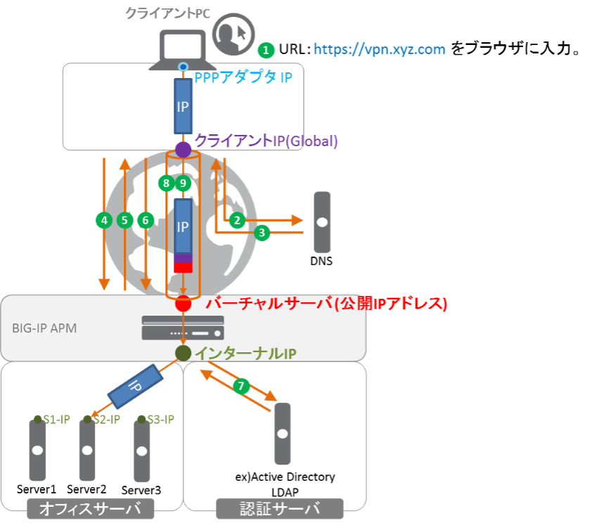

APMネットワークアクセス動作概要
======================================

APMのネットワークアクセスは、以下のような流れで動作します。

1. クライアントがWebブラウザにURL: https://vpn.xyz.comを入力。
2. クライアントPCはvpn.xyz.comのIPアドレスを解決するために、DNSクエリを送信。
3. DNSサーバからvpn.xyz.comのIPアドレスを得る。
4. Webブラウザは、そのIPアドレス (バーチャルサーバ)宛にHTTPSリクエストを送信。
5. BIG-IP APMは、ログインページを表示。
6. クライアントは、ユーザ名とパスワードを入力。
7. BIG-IP APMは認証サーバに問合せを行い、認証が正しく行われたことのレスポンスを得る。
8. BIG-IP APMはクライアントPCとの間でSSL-VPNトンネルを確立する。このとき、クライアントPCのPPPアダプタには事前にAPMに設定されたIPアドレスプールの中から一つIPアドレスが払い出される。(この後クライアントPCは、PPPアダプタを使ってオフィスサーバ群へアクセスができるようになる。)
9. PPPアダプタから出たIPパケットは、インターネット上のグローバルIPアドレスでカプセル化 (=トンネル化)されBIG-IP APMに到着。APMはそのカプセル化を解き、APMのルーティングテーブルに従ってそのカプセル化が解かれたIPパケットを送り出す。
