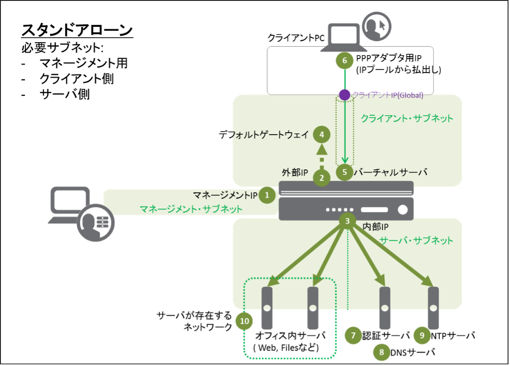

スタンドアローン
======================================

構成イメージは、以下の通りです。

上図1-9のIPアドレスが必要になりますので、あらかじめご用意ください。
F5 UDF Labの場合、設定項目は以下の通りとなります。
なお、「1 管理IP」は工場出荷時に192.168.1.245/24がプリセットされています。

.. csv-table:: :header: "","項目","名前 (サンプル)","値"

   "","ホスト名","big50.f5jp.local",""
   "1","管理IP","","10.1.1.5/24"
   "2","Externalインタフェース (Self IP)","external-ip","10.1.10.50/24"
   "3","Internalインタフェース (Self IP)","internal-ip","10.1.20.50/24"
   "4","デフォルトゲートウェイ","Default-GW","10.1.10.1"
   "5","Virtual Serverアドレス","NetAccess-001_vs","10.1.10.60:443"
   "6","PPPアダプタ用IPアドレスプール","NetAccess-001_lp","10.1.20.211-220"
   "7","認証サーバ (Active Directory)","NetAccess-001_aaa_srvr","10.1.20.100"
   "8","DNSサーバ","","10.1.1.2"
   "9","NTPサーバ","","10.1.20.202"
   "10","サーバが存在するネットワーク","","10.1.20.0/24"
   "","Active Directoryドメイン名","","corp.f5jp.local"
   "","CLIパスワード (デフォルト),"","ID/Password: root/default"
   "","GUIパスワード (デフォルト),"","ID/Password: admin/admin"
   
