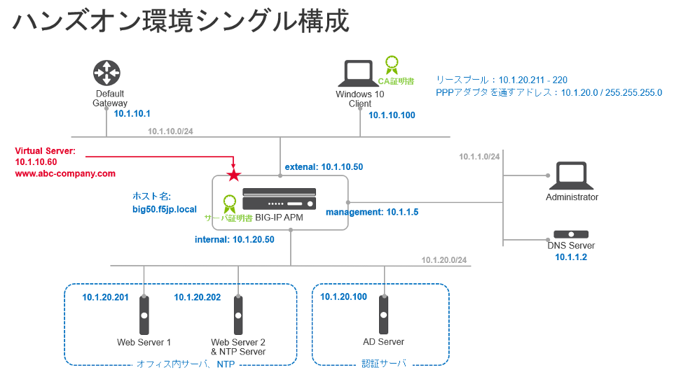

スタンドアローンのネットワーク・サンプル
======================================

冗長化しない状態を想定して、1台のみ設定していきます。

- BIG-IP APMリモートアクセス用Virtual Serverは"10.1.10.60:443"とします。
- Active Directoryのドメイン名は「corp.f5jp.local」とします。
- Active Directoryには、以下のユーザが登録されています。

.. csv-table:: :header: "ユーザ名","パスワード","グループ"

   "test1001","ilovef5!","CorpA-Group"
   "test1002","ilovef5!","CorpB-Group"
 

- BIG-IPのデフォルトゲートウェイは、インターネット方向を想定したルーター"10.1.10.1"に設定します。
- 動作確認は、テスト用に設置したPC (図中の「Windows 10 Client」)から行います。