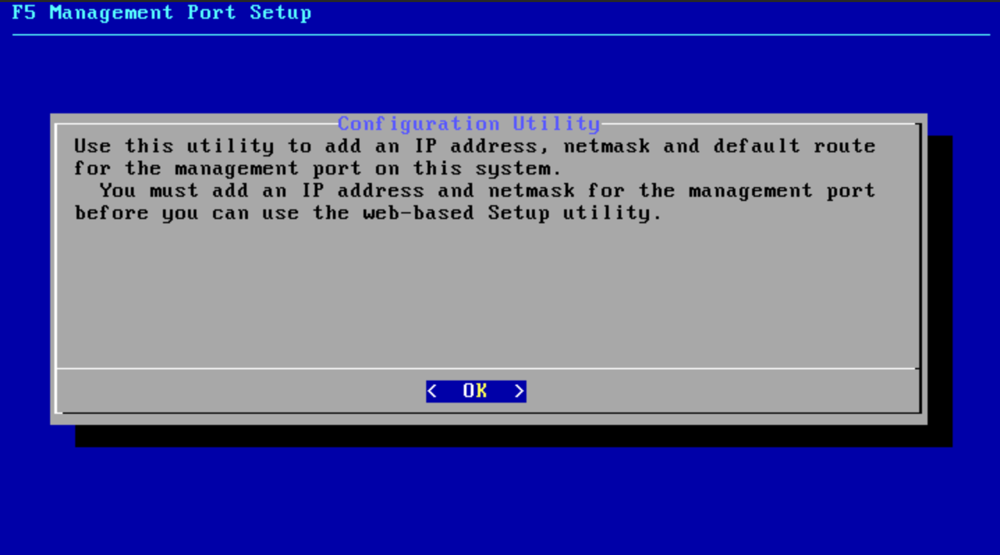
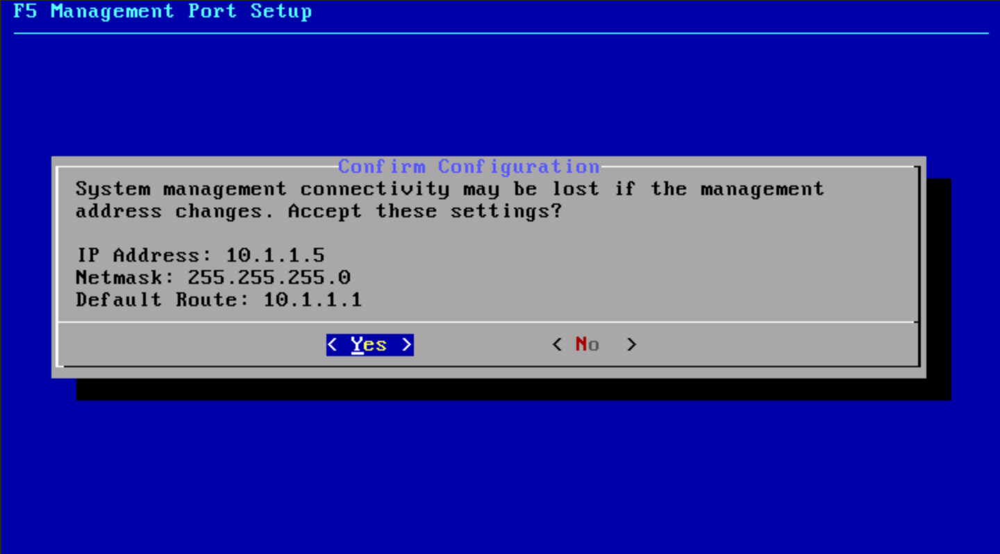

管理ポートのIPアドレス設定
======================================

最初に、BIG-IPの管理ポートにIPアドレスを設定します。

.. note::
   F5 UDF Labでは設定済みなので、実施不要です。

- コンソールポートにrootユーザーでログインして、「config」と入力し、管理ポートの設定ユーティリティを起動します。

- 管理ポートのIPアドレス (IPv4/IPv6)、サブネットマスク、デフォルトルートを設定します。DHCPで動的に取得する設定も可能です。設定を確認後、「Yes」を選択して終了します。

