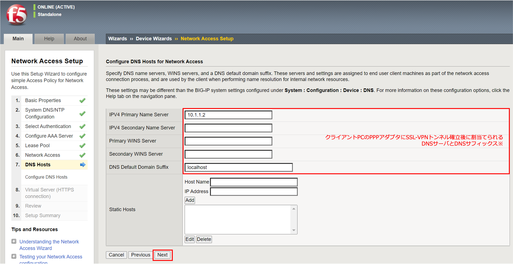
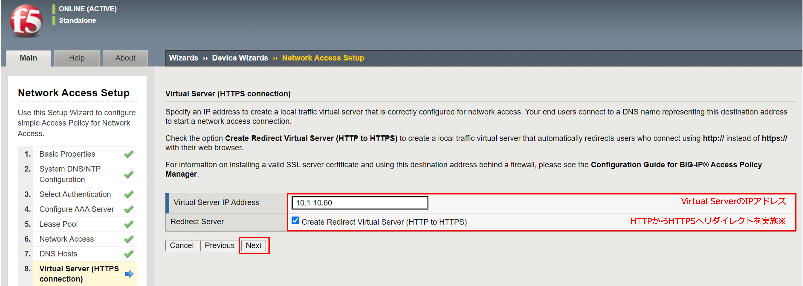

ウィザードを使って設定する方法
======================================

ウィザード (Wizards)を利用すると、ネットワークアクセス設定に必要な情報が一通りそろっていれば、簡単に10分程度で設定することができます。

- 「Wizards」 → 「Device Wizards」で、「Network Access Setup …」を選択し、「Next」を押します。

- 以下の情報を入力 (または選択)し、「Next」を押します。。

- Time Server (NTP)のIPアドレスを入力し、「Next」を押します。 (DNSは設定済みなので入力は不要です。)

- 利用する認証サーバ (Active Directory)を選択し、「Next」を押します。

- Active Directoryによる認証に必要な情報を入力し、「Next」を押します。 (Local User DBを利用する場合、「No Authentication」を選択しますので、このステップはありません。)

- IPアドレスプールを設定し、「Next」を押します。

- スプリット・トンネルを設定し、「Next」を押します。

.. note::

   **スプリット・トンネルとは？**
   
   SSL-VPNトンネルを使う通信と、使わない通信を分けたいときに使います。
   
   例えば、以下のような要件があったとします。

   | 1.	社内LANのサーバは10.99.2.0/24と10.99.100.0/24に設置されているのでSSL-VPNトンネルを使いたい。
   | 2.	しかし、同時にインターネットも使いたい。
   
   このような要件を実現するのがスプリット・トンネルです。
   
   .. figure:: images/mod5-1-8.png
      :scale: 70%
      :align: center
   
   「Use split tunnelling for traffic」を選択し、トンネルに向かわせたいネットワーク帯を指定することで、そのネットワークへの通信のみSSL-VPNトンネルを通り、それ以外はクライアント自身のIPアドレス (上図の"1.1.1.1")を使ってインターネット (上図"3.3.3.3"のwebサーバへの通信)へアクセスする、ということが可能になります。

- クライアントPCに割り当てたい情報を設定し、「Next」を押します。

※ここに指定したDNSサフィックス宛の通信 (f5jp.local)はこのDNSサーバを利用する、という設定です。

- Virtual Serverを設定します。

※このチェックボックスを有効にすることで、HTTP (80)でVirtual Serverへアクセスしても、自動的にHTTPS (443)へリダイレクトするVirtual Serverが生成されます。

- 設定のレビュー (確認のみ)です。

- 設定のサマリ (こちらも確認のみ)です。

