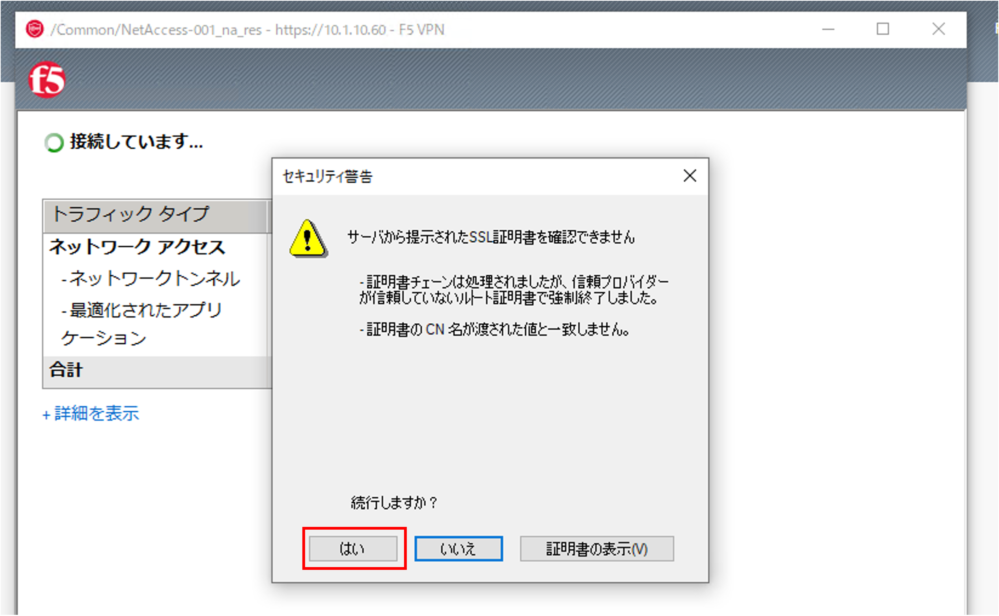

クライアントからのアクセス
======================================

CONSOLE又はRDPで、クライアントPCにログインします。

.. note::
   F5 UDF Labの場合、ID/Passwordは両方とも **user** です。

SSL-VPN接続には、専用のクライアントソフトウェア (Edge Client)を利用した方法と、Webブラウザからアクセスする方式 (F5 Helper Application)の2種類あります。ここでは、Webブラウザから接続する方法を試します。

WindowsのWebブラウザからのアクセス
--------------------------------------

| クライアントPCのWebブラウザから、設定したVirtual Server (10.1.10.60)へアクセスします。
| 以下は、Windows 10およびChromeを使った場合の例です。

- BIG-IPが持つデフォルトのサーバ証明書は、正式な認証局で取得したものではないため、クライアントPCのWebブラウザでVirtual Serverへアクセスすると以下のような警告が出ます。「詳細設定」→「10.1.10.60にアクセスする (安全ではありません)」を選択してアクセスします。

- 認証フォーム画面が現れますので、Active Directoryに登録されているユーザ名とパスワードを入力します。(:doc:`../../content02/module02/module02` を参照。)

- 初回アクセス時には、SSL-VPNクライアント用のクライアントコンポーネントをインストールする必要があります。ダウンロードボタンを押して、実行します。 (インストールには管理者権限が必要となります。) インストールが完了後、”ここをクリックしてください。”をクリックします。

- 「F5 Network VPNを開く」を選択して、ブラウザの信頼済みサイトのセキュリティ警告を許可します。

.. figure:: images/mod5-2-1-4.png
   :scale: 20%
   :align: center

- BIG-IPが持つデフォルトのサーバ証明書が、正式な認証局で取得したものではない事を示す警告が再度表示されるため、「はい」を選択します。

- F5 Networksコンポーネントインストーラの利用を許可します。 (Windowsのユーザアカウント制御の設定によって、表示の有無が変わります。)

- 再度証明書の警告メッセージが表示されますので「はい」を選択します。

- F5 Networks Networks Access Helperの利用を許可します。 (Windowsのユーザアカウント制御の設定によって表示の有無が変わります。)

- 認証完了後、以下の画面が表示され、タスクバーにF5 Helper Applicationのアイコンが表示されます。

- Webブラウザから、以下の社内ネットワークのWebサーバへ直接通信ができることを確認します。また、下記IPアドレスにSSH接続 (ポート22番)できることを確認します。

| **http://10.1.20.201**	
| **http://10.1.20.202**

.. note::
   F5 Helper Applicationのアンインストールは、コントロールパネルのアプリのインストール機能より“BIG-IP Edge Client Components”を選択する事で可能です。
   

