SSLサーバ証明書の設定
======================================

BIG-IPが持つデフォルトのサーバ証明書は正式な認証局で取得したものではないため、クライアントPCのWebブラウザでVirtual Serverへアクセスすると以下のような警告が出ます。

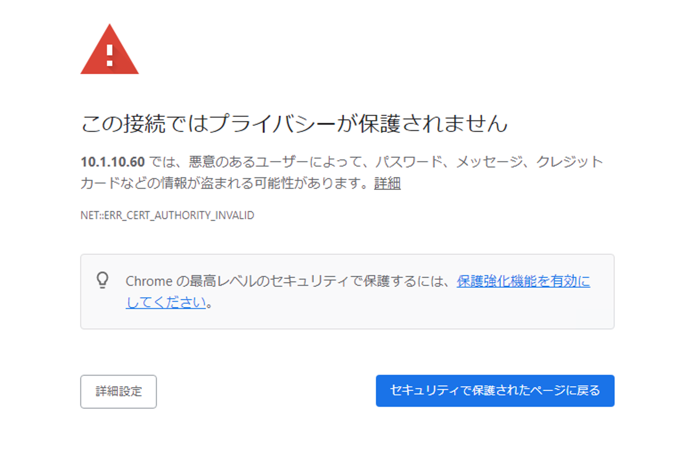

以降で、正式な認証局 (例: Verisign, CyberTrust等)で署名されたサーバ証明書をインポートして利用するまでの手順を示します。

F5 UDF Labで利用するサーバ証明書
--------------------------------------

一般的には、以下の手順でサーバ証明書の発行を行います。

| 1. BIG-IPのGUIでCSRと秘密鍵を生成し、CSRを認証局 (例: Verisign等)に送付する。
| 2. CSRに対して認証局が署名を行うことで、サーバ証明書が完成する。
| 3. サーバ証明書を返送してもらい、BIG-IPへインポートする。

本ガイドでは簡易的に、秘密鍵ファイルとサーバ証明書の両方がすでに存在しているものとしてインポートします。リモートデスクトップ接続したクライアントPC (Windows 10 Client)のデスクトップ上にある、以下のフォルダを開いてください。

.. figure:: images/mod5-3-1-1.png
   :scale: 100%
   :align: center

このフォルダ内の以下2つのファイルを使用します。

1. 秘密鍵ファイル: **abcCompany-key.pem**
2. サーバ証明書ファイル: **abcCompany-cert.pem**

秘密鍵とサーバ証明書のインポート
--------------------------------------

- まず、サーバの秘密鍵をインポートします。

- 「System」 → 「Certificate Management」 → 「Traffic Certificate Management」 → 「SSL Certificate List」で表示された画面右上の「Import」ボタンを押します。

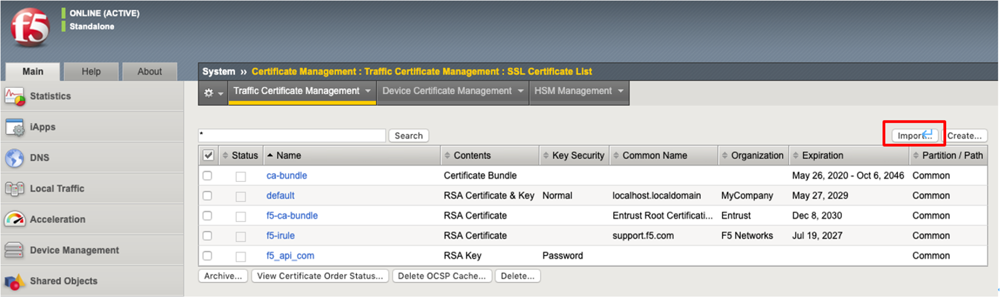

- Keyを選択します。

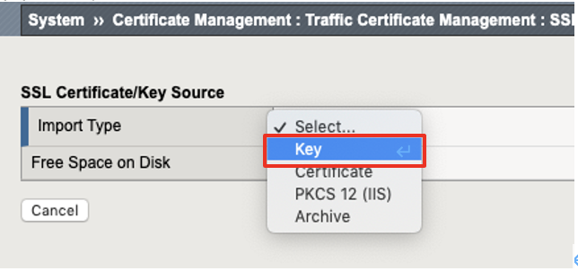

- 以下のように設定します。

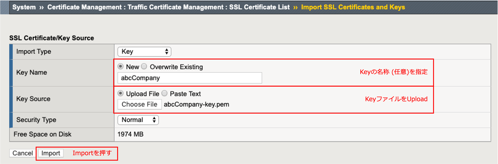

- 以下の状態になります。

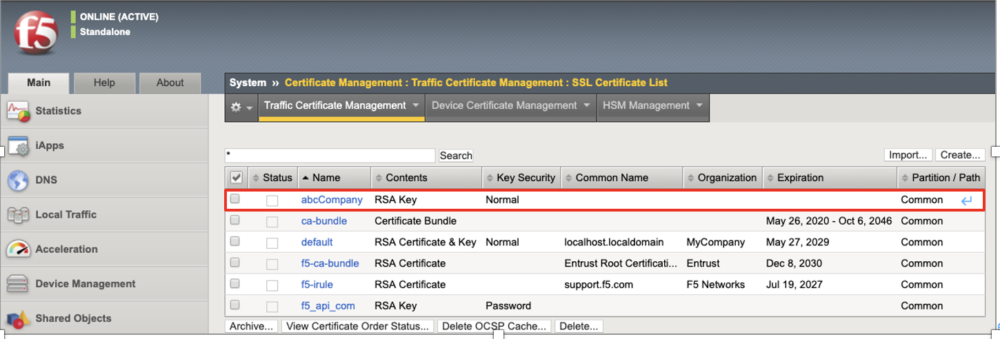

- 次に、サーバ証明書をインポートします。インポートした秘密鍵をクリックすると、以下の画面が現れます。「Import」ボタンを押します。

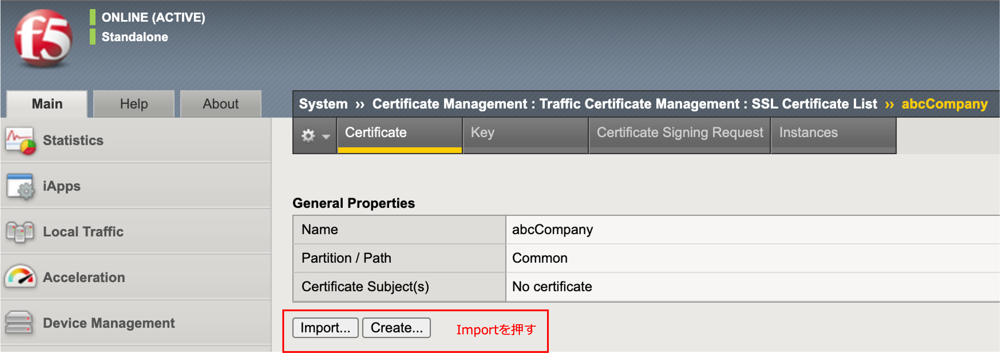

- 以下のように設定して、インポートします。

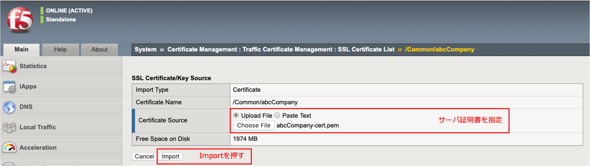

- サーバ証明書がインポートされた状態です。

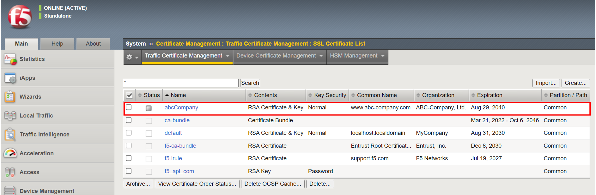

Client SSL Profileの生成とVSへの割当て
--------------------------------------

- Client SSL Profileを作ります。「Local Traffic」 → 「Profiles」 → 「SSL」 → 「Client」で表示された画面右上の「Create」ボタンを押すと、以下の画面が表示されますので、以下のように設定します。

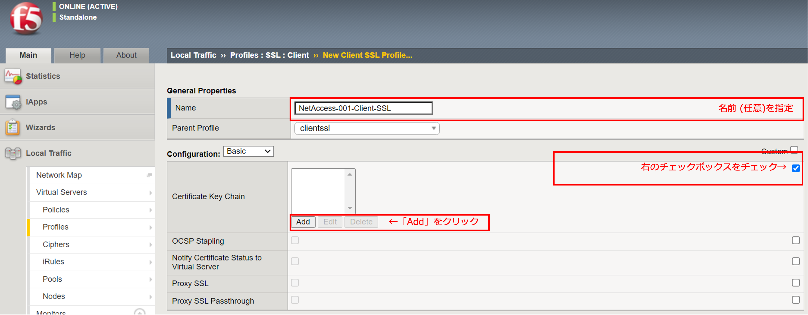

- 「Add」ボタンを押すと以下のような設定画面が表示されるので、「abcCompany」を設定します。

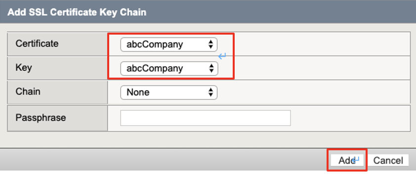

- 以下のように表示されます。

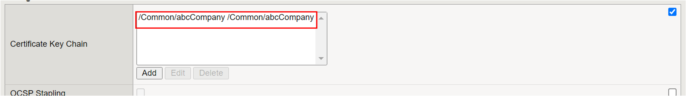

(省略)

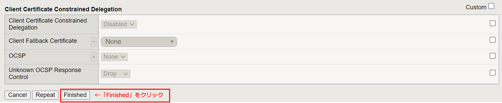

- 作成した設定が登録されていることを確認します。

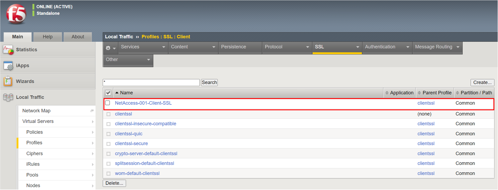

- Virtual ServerへのClient SSL Profileを割り当てます。「Local Traffic」 → 「Virtual Servers」 を選択し、SSL-VPN接続用に設定したVirtual Server (本ガイドの例では"NetAccess-001_vs")をクリックすると、以下の画面が表示されます。

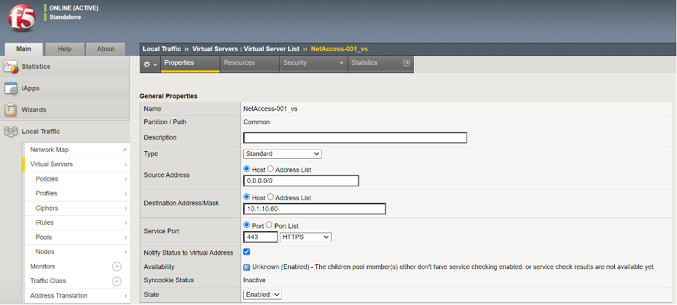

(省略)

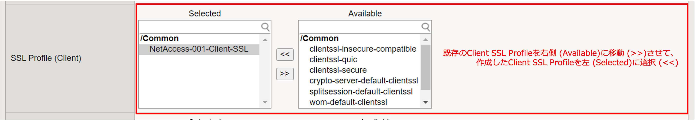

(省略)

