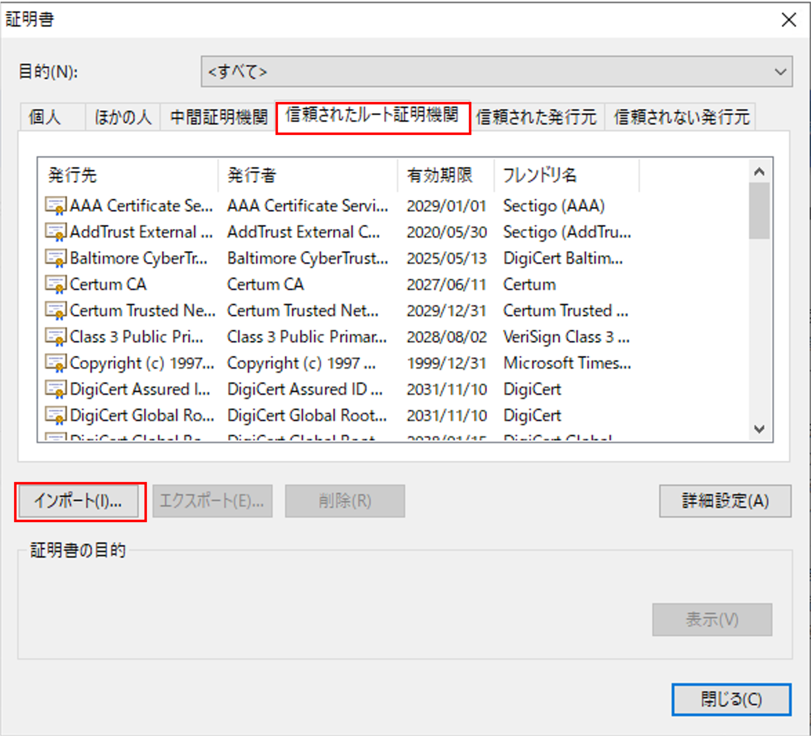
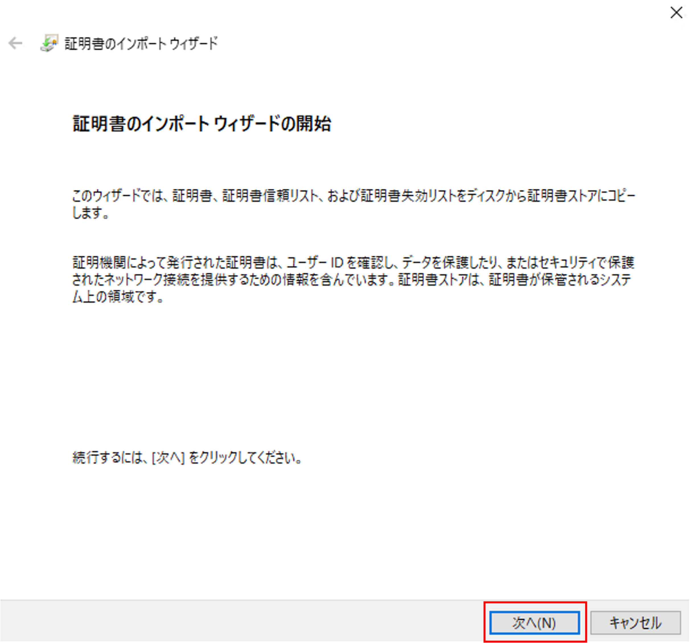
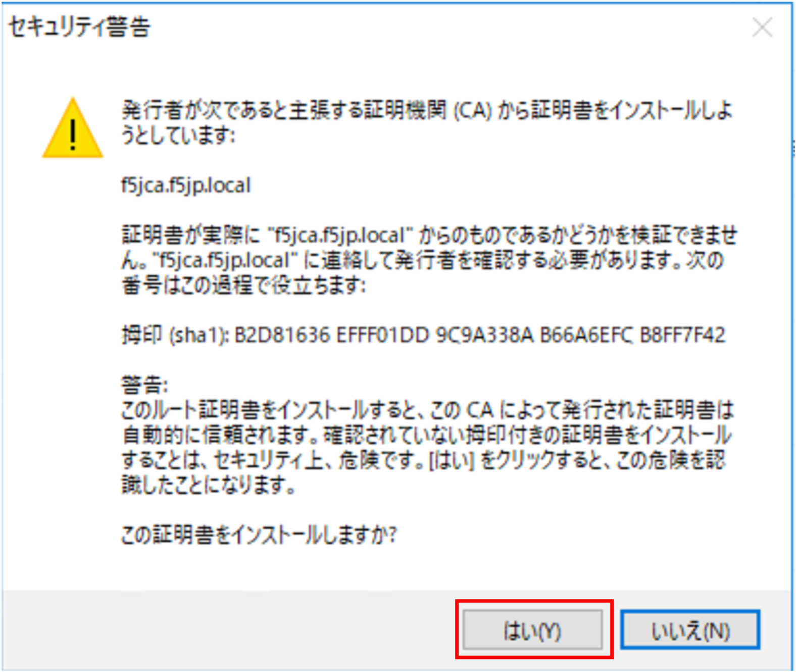
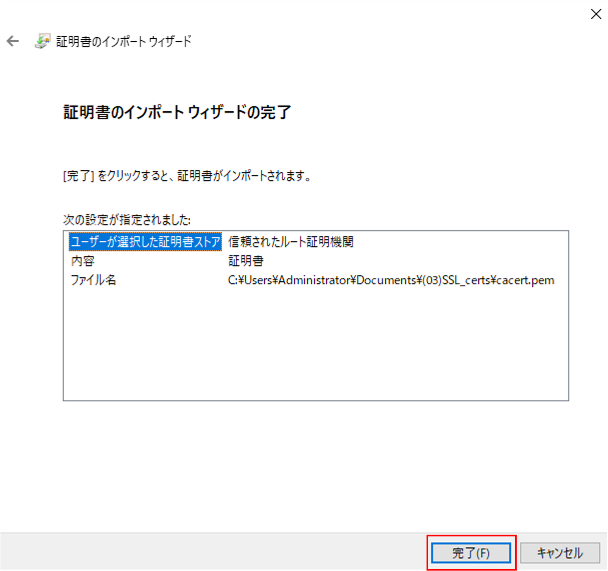
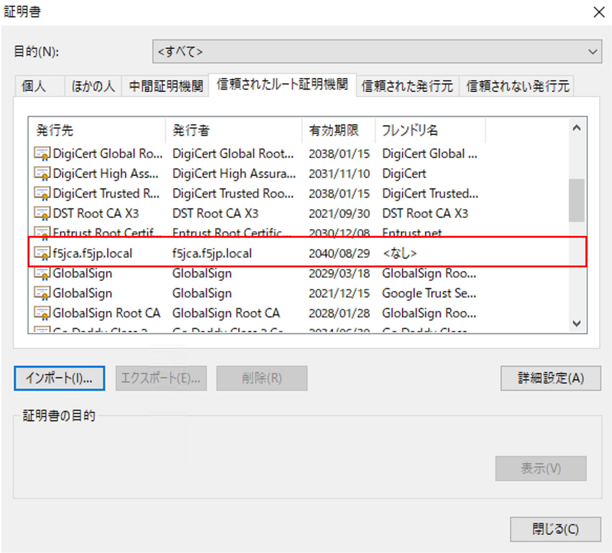
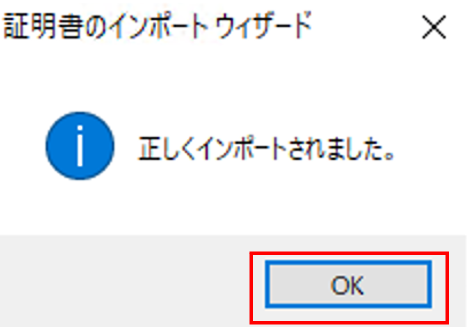
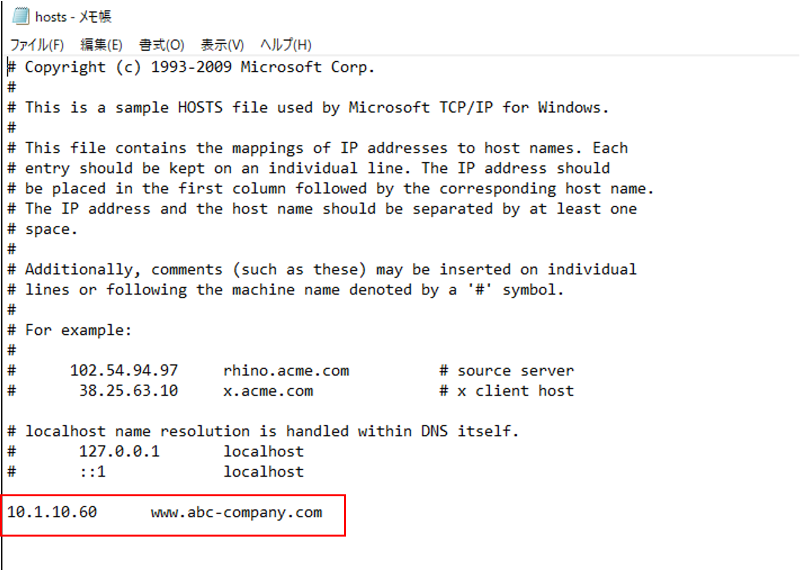
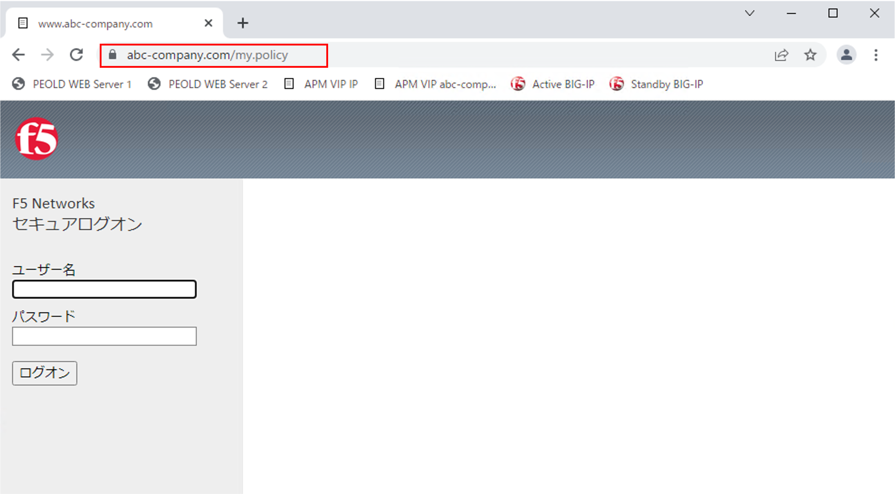

クライアントPCの設定
======================================

.. note::
   F5 UDF Lab環境では、CA証明書はクライアントに設定済みです。

認証局の証明書のインポート
--------------------------------------

-  サーバ証明書をBIG-IPにインポートしただけでは不十分です。このままでは、まだ、以下の画面を見ることになります。(例: Chrome)

.. figure:: images/mod5-4-1-1.png
   :scale: 50%
   :align: center

| この画面が出る理由は、このWebサイト (=BIG-IPのVirtual Server)のサーバ証明書に署名した認証局 (F5J-CA)の証明書がWebブラウザにインポートされていないことが原因です。認証局の証明書がWebブラウザに入っていないと、サーバ証明書の発行元をチェックすることができないためです。
| この問題を回避するために、認証局 (F5J-CA)の証明書 (ルート証明書)を、クライアントPCのWebブラウザへインポートする必要があります。
|
| リモートデスクトップ接続したPCのデスクトップ上にある、以下のフォルダを開いてください。

このフォルダ内の以下のファイルを利用します。

認証局ファイル: **cacert.pem**

以下の手順でクライアントPCのWebブラウザ (例: Chrome)へインポートします。

- クライアントPCのWebブラウザ (例: Chrome)へインポートします。Chromeの設定画面で、証明書の管理を選択します。

.. figure:: images/mod5-4-1-3.png
   :scale: 20%
   :align: center

- 信頼されたルート証明機関」タブを選択し、「インポート」ボタンを押して下ださい。

- 「次へ」を押して下さい。

- インポートするファイルとして、認証局の証明書 (cacert.pem)を選び、「次へ」を押してください。

.. figure:: images/mod5-4-1-6.png
   :scale: 20%
   :align: center

.. note::
   .pemファイルはデフォルトでは表示されないかもしれません。その場合は、「すべてのファイル (*.*)」を選択して下さい。

   .. figure:: images/mod5-4-1-6-note.png
      :scale: 20%
      :align: center

- 証明書ストアが「信頼されたルート証明機関」であることを確認し、「次へ」を押してください。

- 「完了」を押してください。

- 以下のようなセキュリティ警告が表示された場合、ここでは「はい」を選択します。

- 完了です。「OK」を押してください。

- 「信頼されたルート証明機関」に、(f5jca.f5jp.local)のルート証明書がインポートされました。

.. figure:: images/mod5-4-1-11.png
   :scale: 20%
   :align: center

| これで、「信頼されたルート証明機関」として、本ガイドの認証局（F5J-CA）が登録されました。基本的にはこれで証明書のセキュリティ警告は表示されなくなります。
| しかし、DNSによる名前解決ができない環境においては、次のステップも必要です。

クライアントPCのhostsファイルの編集
--------------------------------------

- DNSによる名前解決ができない環境の場合、URLとしてIPアドレスを入力することになります。この場合、クライアントPCへ認証局の証明書をインポートしても、引き続き、以下の画面が表示されます。

.. figure:: images/mod5-4-1-1.png
   :scale: 50%
   :align: center

| これは、Webサーバ（＝Virtual Server）へアクセスして、Webサーバからサーバ証明書を受け取ったものの、サーバ証明書に記載されたCommon Nameと、接続を要求したFQDN (≒URL)が一致しないことが原因です。
| 検証環境で比較的簡単に回避するためには、クライアントPC: Windowsのhostsファイルを編集することです。

本例では、サーバ証明書のCommon Nameは「www.abc-company.com」です。

- Windowsの「メモ帳」アプリを、管理者権限で実行します。

.. figure:: images/mod5-4-2-1.png
   :scale: 20%
   :align: center

- C:\\Windows\\System32\\drivers\\etc\\hosts を編集します。hostsに指定するアドレスは、設定したVirtual ServerのIPアドレスを指定してください。

.. note::

   「hosts」ファイルはデフォルト状態では表示されないかもしれません。その場合は「すべてのファイル(*.*)」を選択してください。)
   
   .. figure:: images/mod5-4-2-2.png
      :scale: 20%
      :align: center

Webブラウザへ入力するURLは、IPアドレスではなくFQDN (https://www.abc-company.com)で入力します。これで、SSL証明書のセキュリティ警告を見ることなく、BIG-IPのVirtual Server経由でWebサーバへ接続することができます。

