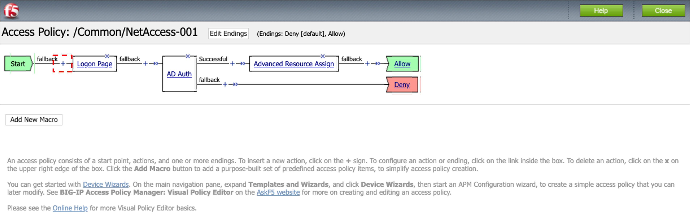

クライアント証明書認証の設定
======================================

クライアント証明書による認証を行う設定方法を記載します。

クライアント証明書の発行
--------------------------------------

クライアント証明書認証の設定を行うためには、以下2つの証明書が必要です。

| 1. 認証局の証明書: BIG-IP側で利用します。
| 2. クライアント証明書: クライアントPC側で利用します。

クライアント証明書の発行には、大きく以下2つの方法があります。

| a) 商用の認証局 (Verisign、CyberTrust等)から発行してもらう
| b) 独自の認証局 (例: OpenSSLの利用)を建てて、発行する

本ガイドでは、b)の方法: OpenSSLを使って独自の認証局を建てて、クライアント証明書を発行したものを利用します。リモートデスクトップ接続したPCのデスクトップ上にある、以下のフォルダを開いてください。

.. figure:: images/mod6-1-1.png
   :scale: 100%
   :align: center

このフォルダ内の以下のファイルを使用します。

クライアント証明書ファイル: **abc-client001.p12**

クライアントPCへのクライアント証明書インポート
--------------------------------------

クライアント証明書 (PKCS#12)をクライアントPCへインストールする手順について、参考までに記載します。本ガイドのクライアントPCは、Windows10およびChromeを利用しています。

- Chromeの設定画面で、証明書の管理を選択します。

.. figure:: images/mod6-1-2-1.png
   :scale: 20%
   :align: center

- 個人タブを選択して「インポート」ボタンを押します。

.. figure:: images/mod6-1-2-2.png
   :scale: 20%
   :align: center

- 「次へ」ボタンを押します。

.. figure:: images/mod6-1-2-3.png
   :scale: 20%
   :align: center

- 「参照」ボタンを押し、クライアント証明書を選択して、「次へ」ボタンを押します。

.. figure:: images/mod6-1-2-4.png
   :scale: 20%
   :align: center

.. note::
   .p12ファイルはデフォルトでは表示されないかもしれません。その場合は、「すべてのファイル (*.*)」を選択して下さい。

   .. figure:: images/mod6-1-2-4-note.png
      :scale: 20%
      :align: center

- 秘密キーがパスワードで保護されているので、パスワードを入力して、「次へ」ボタンを押します。 (OpenSSLで発行する際に指定したパスワードは「f5demo」です。)

.. figure:: images/mod6-1-2-5.png
   :scale: 20%
   :align: center

- 「次へ」ボタンを押します。

- 「完了」ボタンを押します。

- 以下のようにクライアント証明書が登録されます。クライアント証明書をダブルクリックすると、証明書の詳細が確認できます。

.. figure:: images/mod6-1-2-8.png
   :scale: 20%
   :align: center

BIG-IPの設定
--------------------------------------

クライアント証明書認証に必要な、BIG-IPの設定を示します。

認証局の証明書のインポート
^^^^^^^^^^^^^^^^^^^^^^^^^^^^

- あらかじめ、認証局の証明書を、BIG-IPの設定用GUIへアクセスするPCにコピーしておきます。 (F5 LAB環境では以下を利用します。)

認証局ファイル: **cacert.pem**

- 「System」 → 「Certificate Management」 → 「Traffic Certificate Management」 →「SSL Certificate List」で表示された画面右上の「Import」ボタンを押し、Certificateを選択します。

- 以下のように設定し、Importボタンを押します。

- 以下の状態になります。

Client SSL Profileの設定
^^^^^^^^^^^^^^^^^^^^^^^^^^^^

「SSLサーバ証明書の設定」で生成した、Client SSL Profileを編集します。「Local Traffic」 → 「Profile」 → 「SSL」 → 「Client」で、該当するProfileをクリックすると、以下の画面が現れます。以下の通り設定します。

VPE (Visual Policy Editor)の設定
^^^^^^^^^^^^^^^^^^^^^^^^^^^^^^^^^

クライアント証明書認証を実施するための設定をVPEに反映します。

- 「Access」→「Profiles / Policies」で表示されたNetAccess-001のEditをクリックしてVPEを表示します。

- ここまでの設定では、VPEは以下の状態になっています。Logon Pageの前にある「+」をクリックします。

- 「Authentication」タブの「On-Demand Cert Auth」にチェックを入れ、「Add Item」ボタンを押します。

- 「Auth Mode」を「Require」に変更し、「Save」ボタンを押します。

- 「Apply Access Policy」を押します。

クライアントからのアクセス
--------------------------------------

- クライアントPCのWebブラウザから、APM Virtual Serverへアクセスします。
- クライアント証明書の選択画面が出たら、該当する証明書をクリックします。

- ユーザ名とパスワードを入力し、APMへのアクセス (SSL-VPN接続)が完了することを確認します。 (:doc:`../../content05/module02/module02` を参照。)
