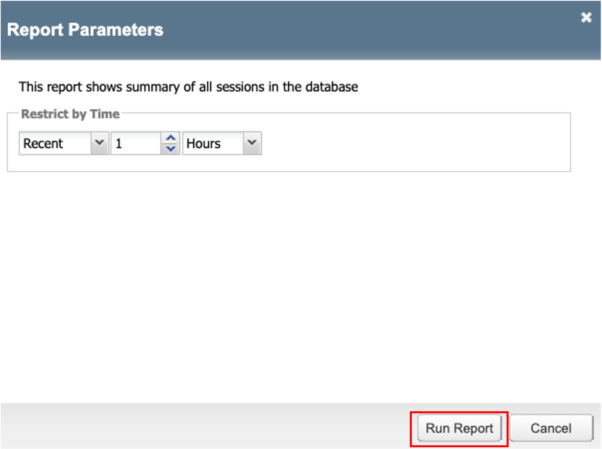
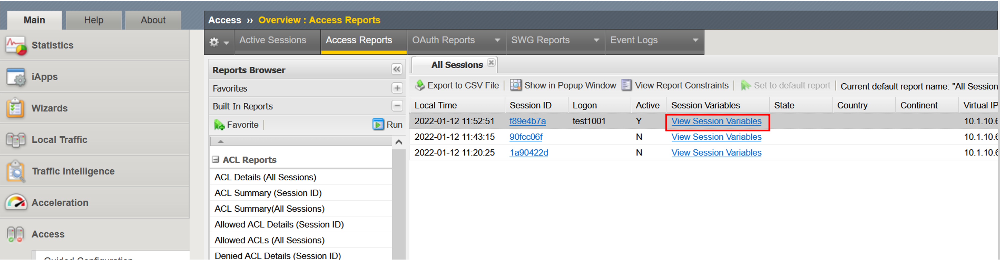
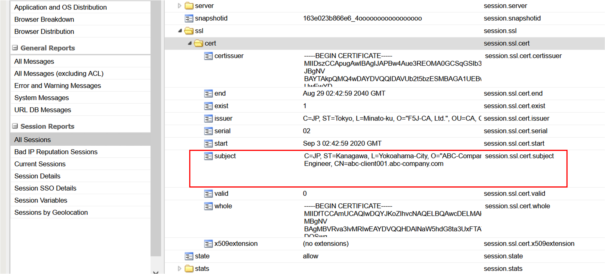

セッション変数について
======================================

BIG-IP APMには、セッション変数 (Session Variables)という便利な機能が実装されています。このセッション変数を利用することで、例えば「クライアント端末が持つ情報とActive Directoryで管理している情報を突き合わせて、情報が一致すれば次のアクションを実施する」といったポリシーを生成することが可能です。

先のセクションで設定したクライアント証明書認証において、そのクライアント証明書内の値がセッション変数に取り込まれますので、その情報を利用することも可能です。セッション変数の確認方法を以下に示します。

- クライアントがAPMに接続された状態にします。
- 「Access」 → 「Overview」→ 「Access Reports」を選ぶと、以下の画面が現れます。「Run Report」ボタンを押します。

- アクセスしたLogonユーザの行に表示されている、「View Session Variables」をクリックします。

- 表示された画面のVariable Nameの中で、「ssl」を捜し、▶ボタンをクリックして展開すると、クライアント証明書の詳細が表示されます。

上図の赤点線囲みの部分を例にとりますと、「session.ssl.cert.subject」がセッション変数であり、「C=JP, ST=Kanagawa, O="ABC-Comapny, Ltd.", OU=Systems Engineer, CN=abc-client001.abc-company.com」がその値です。

クライアント証明書情報をAPMのセッション変数に取り込む、というのはほんの一例であり、その他にもクライアントが持つ固有の情報 (例: Windowsであれば、NICのMACアドレス、マザーボードのID等)を取り込むことが可能です。このセッション変数を利用することで、ユーザ単位にアクセス制御を行うことが可能です。

以降、このセッション変数を利用したポリシーの設定例をいくつか紹介します。

