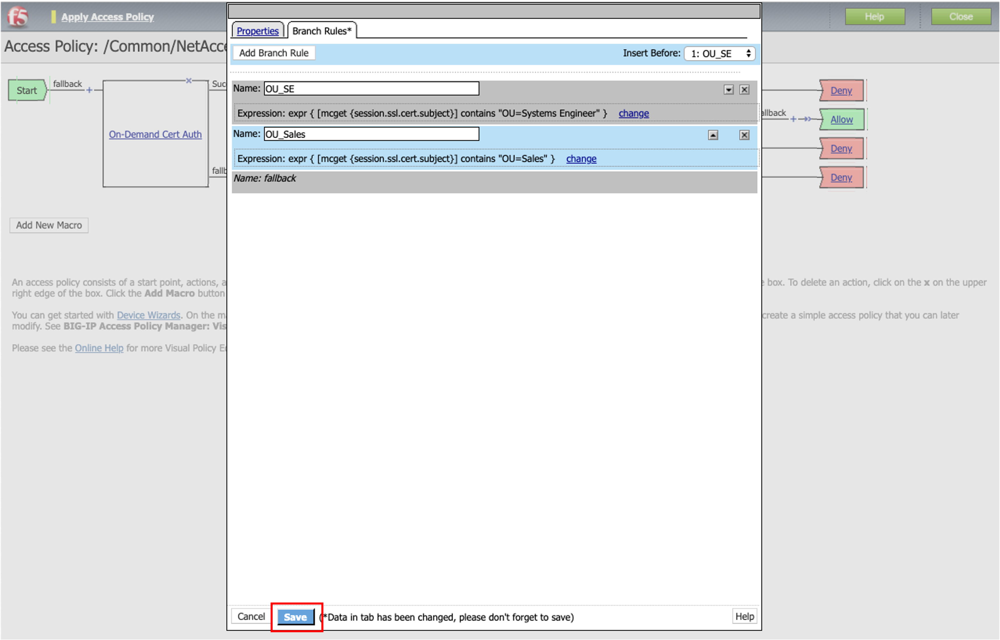

[VPEサンプル-1] クライアント証明書のOUでACLを割当てる
=======================================================

| クライアント証明書のOU単位 (=組織単位)に、アクセスできるサーバを制限したい (=Access Control List (ACL)を適用したい)、という要件があると仮定します。
| 本例では、クライアント証明書のSbjectに、" OU=Systems Engineer "が含まれている場合に、あるACLを割当てる、という設定を行います。

.. _acl:

ACLの作成
--------------------------------------

サンプルとして、実サーバ: 10.1.20.201へのSSH (Port 22)アクセスを止めるACLを作成します。

- 「Access」 → 「Access Control Lists」で表示された画面の右上の「Create」ボタンを押すと、以下の画面が表示されます。以下のように設定して、「Create」ボタンを押します。

- 「Access Control Entries」の横の「Add」ボタンを押します。

- Typeとして“L4”を選択します。

- 送信元は特定せず (=Any)、宛先が10.1.20.201のSSH (Port 22)を止める設定を行います。

- 以下の状態になります。

VPEの設定
--------------------------------------

OU単位にACLを適用するために、VPEの設定を変更します。

- 「Access」→「Profiles/Policies」で表示された"NetAccess-001"の「Edit」をクリックして、VPEを表示します。

.. figure:: images/mod6-3-2-1.png
   :scale: 20%
   :align: center

- AD AuthのSuccessfulの後ろにある「+」をクリックします。

- 「General Purpose」タブで「Empty」を選択し、「Add Item」ボタンを押します。

.. figure:: images/mod6-3-2-3.png
   :scale: 20%
   :align: center

- 「Branch Rules」タブを選択します。「Add Branch Rule」ボタンを押して、Expressionを1つ追加し、「Change」をクリックします。

- 「Advanced」タブを選択し、以下のようにTCL形式で入力します。

「mcget」コマンド: このコマンドによって、BIG-IP APMのセッション変数 (Session Variable)に取り込まれた値を取り出します。この構文によって、セッション変数: "session.ssl.cert.subject"の値に" OU=Systems Engineer "が含まれているかどうかを確認します。確認結果がOKであれば次のボックスへ進みます。

- 「Name」を分かりやすいものに変更し、「Save」ボタンを押します。

- 同様の方法で、2つ目の分岐 (OU=Salesの場合)も追加してみた状態です。VPEの見た目上、SEを一番上にしたい場合、以下の▲ボタンを押します。

- 以下のように、上下が入れ替わります。「Save」ボタンを押します。

この例では、以下のように「Fallback」に「Advanced Resouce Assign」がつながっています。このままだと、OU=Systems Engineerでも、OU=Salesでもないものに対して、リソースがアサインされる状態になっていますので、これを変更します。「Fallback」の後ろにある「>>」のマークをクリックします。

- 以下のような画面に変わります。「Advanced Resource Assign」を繋ぎたい分岐 (この例ではOU_SE)の「^」になっている部分をクリックします。

- 以下のように、「Advanced Resource Assign」が移動します。次に"OU_SE"の分岐にACLを割当てるため、その分岐の「+」をクリックします。

- 「Assignment」タブの「ACL Assign」を選択し、「Add Item」ボタンを押します。

- 「Add/Delete」をクリックします。

- 既に作成したACL (TEST1001-ACL)のチェックボックスにチェックを入れ、「Save」ボタンを押します。

- 以下の状態になります。「Apply Access Policy」を押して、設定を適用します。

クライアントからのアクセス
--------------------------------------

- OU=Systems Engnieerのクライアント証明書を持つクライアントPCから、APMのVSへアクセスします。
- アクセス完了後、10.1.20.201のSSH (Port 22)へのアクセスだけがRejectされ、http (Port 80)にはアクセスできることを確認します。
