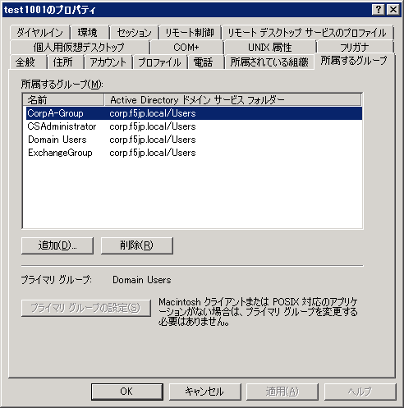

[VPEサンプル-2] Active DirectoryのGroupでACLを割当てる
=======================================================

| Active Directoryのユーザが属するGroup毎に、アクセスできるサーバを制限したい (=Access Control Listを適用したい)、という要件があると仮定します。
| 本例では、「"CorpA-Group"に属するユーザ"test1001"に対してACLを適用し、"CorpB-Group"に属するユーザ"test1002"にはACLを適用しない」、という設定を行います。

ACLの作成
--------------------------------------

 :ref:`acl` 参照。 

Active Directoryユーザ: test1001 (F5 UDF Labの場合の例)
-----------------------------------------------------------

F5 UDF Labでは、Active Directoryのユーザー設定は以下の通りとなっています。

- 「全般」タブ

- 「所属するグループ」タブ: ユーザー"test1001"は、グループ"CorpA-Group"に属しています。このCorpA-Groupグループに対して、ACLを割当てる設定を行います。

VPEの設定
--------------------------------------

- ここまでの設定では、VPEは以下のようになっています。一旦、On-Demand Cert AuthとEmpty以降をすべて削除します。ボックスの右上の「×」をクリックします。

- 以下のような画面が現れます。そのまま、「Delete」を押します。

- 同様の手順で、「Empty」「ACL Assign」「Advanced Resource Assign」も削除し、以下の状態にします。「AD Auth」のSuccessful分岐上の「+」をクリックします。

- 「Autentication」タブの「AD Query」を選択し、「Add Item」ボタンを押します。

- 「Server」として、既に設定したActive Directory設定 (NetAccess-001_aaa_srvr)を選択します。「SerchFilter」には、以下を入力します。

.. code-block:: bash

   sAMAccountName=%{session.logon.last.username}

SearchFilterに入力した「sAMAccountName」は、Active Directoryで定義されている、ユーザ名の変数です。この変数にAPMにログインしたときのユーザ名 (例: test1001)を代入して、AD Queryを実施するという定義です。

APMにログインしたときのユーザ名は、セッション変数:「session.logon.last.username」の値として格納されていますので、「=%{session.logon.last.username}」で代入を行います。

- 「Branch」タブで、「Change」をクリックします。

- 「Simple」タブ上で、デフォルトで設定されている「User's Primary Group ID is 100」を「×」ボタンを押して削除します。

.. figure:: images/mod6-4-3-7.png
   :scale: 20%
   :align: center

- 「Add Expression」ボタンをクリックすると、以下の画面が現れます。ここでは単純に「AD Queryが成功したら、次のBOXに移動する」定義にしています。以下の状態にして、「Add Expression」ボタンを押します。

- 以下の状態になります。「Finished」ボタンを押します。

- 「Name」に区別しやすい名称 (ここでは、Query_Passedとしました)を入力し、「Save」ボタンを押します。

- 以下の状態になりますので、「AD Query」の「Query_Passed」分岐上にある「+」をクリックします。

- 「Assignment」タブの「AD Group Resource Assign」を選択し、「Add Item」ボタンを押します。

- 登録済みのAD Serverを選択し、Groupsの下にある行の「edit」をクリックします。

- 「Groups」タブで、「New Group」にActive Directoryのグループ名を入力し、「Add group manually」ボタンを押します。

- 以下の状態になります。

- 「Static ACL」タブで、既に設定したACLのチェックボックスにチェックを入れます。

- 「Network Access」タブで、既に設定したNetwork Accessのチェックボックスにチェックを入れます。

- 「Webtop」タブで、既に設定したWebtopのラジオボタンを選択し、Updateボタンを押します。

- 以下の状態になりますので、CorpB-Group設定を追加するために「Add new entry」ボタンを押します。

- 同様の手順でCorpB-Groupの設定を行いますが、こちらはACLを割り当てない設定にしています。また、必要に応じてACLの順番を入れ替えます。

- 以下の状態になります。「Apply Access Policy」を押して、設定を適用します。

クライアントからのアクセス
--------------------------------------

- クライアントPCから、CorpA-Groupに属するユーザ: "test1001"で、APMのVirtual Serverへアクセスします。
- アクセス完了後、10.1.20.201のSSH (Port 22)へのアクセスだけがRejectされることを確認します。
- クライアントPCから、CorpB-Groupに属するユーザ: "test1002"で、APMのVirtual Serverへアクセスします。
- CorpB-GroupにはACLが割り当てられていないので、すべてのアクセスが通過する (=何もRejectされない)ことを確認します。

[ご参考] AD Queryがうまく行かない場合: AAA設定の変更
----------------------------------------------------

Active Directory設定またはそのユーザ設定によっては、Administrator権限が必要となる場合があります。その場合には、以下の部分を追加してみてください。

.. note::
   F5 UDF Lab環境では必要ありません。あくまでご参考情報となります。

「Access」 → 「Authentication」 → 「Active Directory」 → 設定済みのAAAサーバをクリックすることで、以下の画面が現れます。以下の赤囲み部分を追加してみてください。

また、以下のKBに記載されているadtest toolを使うことによってADサーバとのクエリテストを行うことができます。

| K11308: Overview of the adtest tool
| https://support.f5.com/csp/article/K11308
