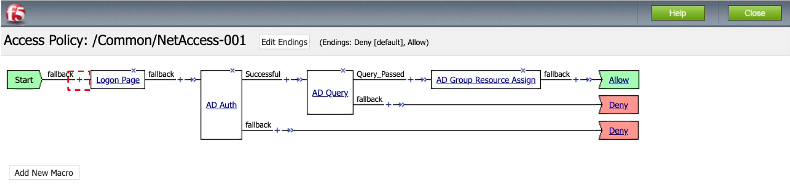
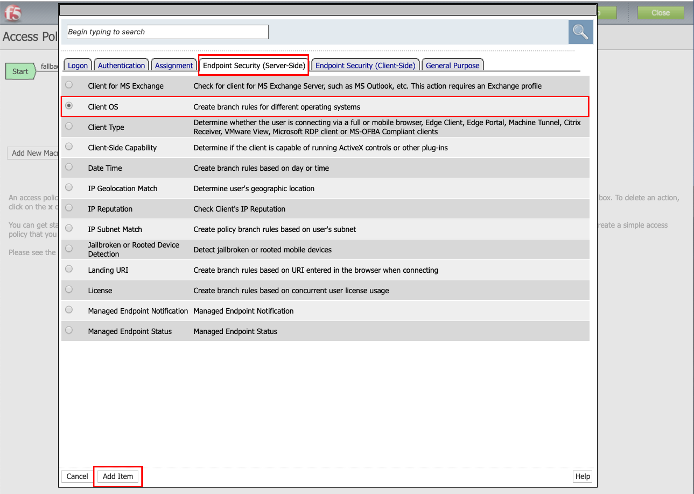
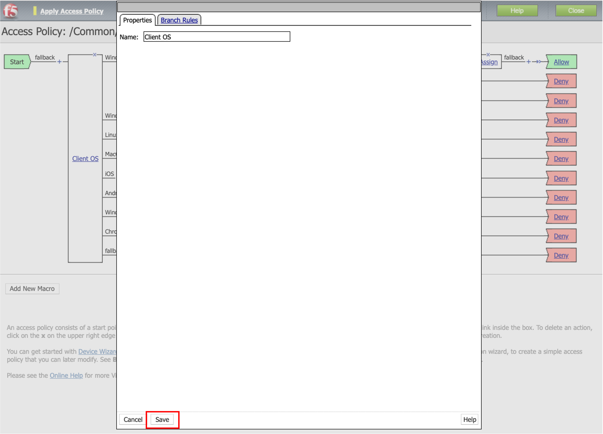
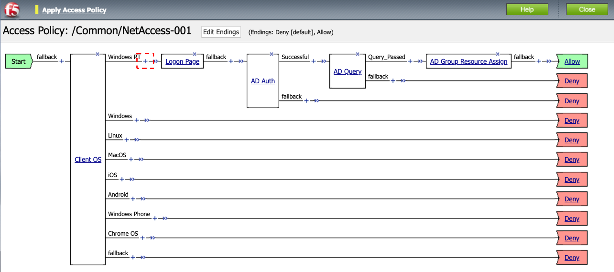
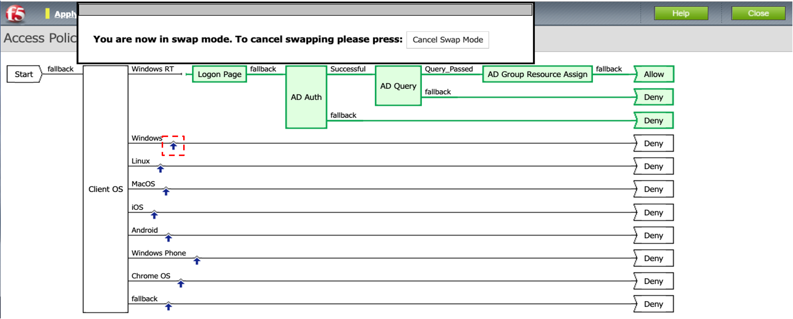
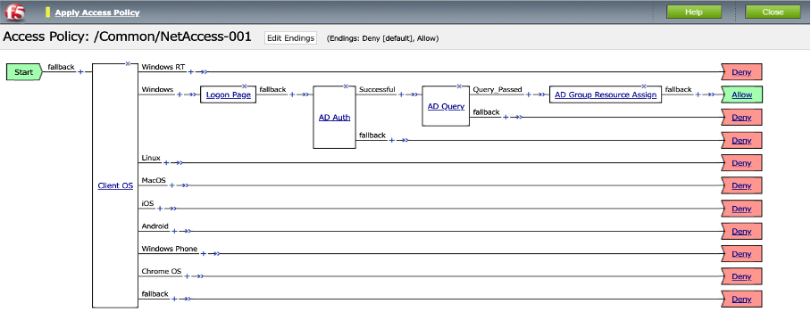
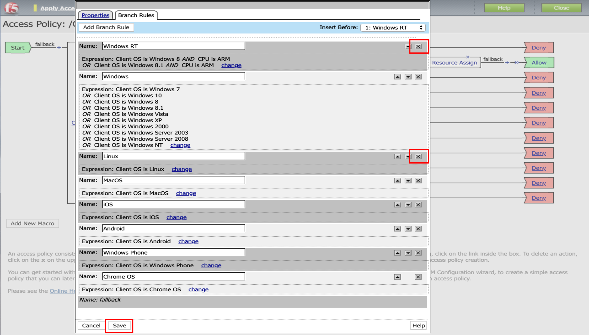
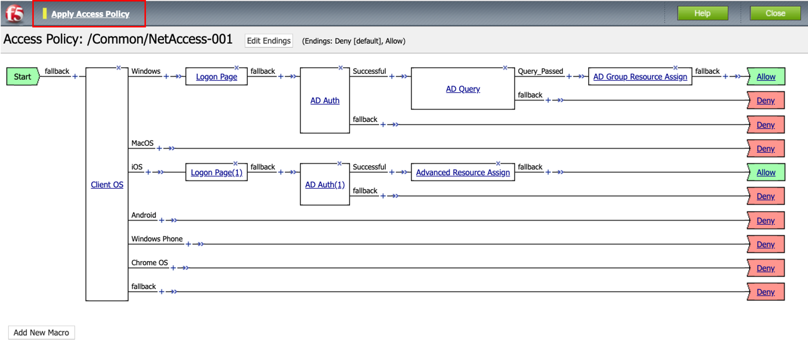

[VPEサンプル-3] クライアントOSの種類に応じてポリシーを変える
=======================================================

| クライアントOS毎にポリシーを変更したい、という要件があると仮定します。
| 例としてWindowsクライアントには[VPEサンプル-2]で設定したポリシーを適用し、iOS (Apple iPhone/iPad)にはそれとは異なるポリシーを適用する、という設定を行います。

- ここまでの設定では、以下の状態になっています。「Logon Page」前の「+」をクリックします。

- 「Endpoint Security (Server-Side)」タブで、「Client OS」を選択し、「Add Item」ボタンを押します。

- 「Save」をクリックします。

- 「Windows RT」から「Windows」に移行するために、Windows RTの右の「>>」をクリックします。 

- 以下の状態から「Windows」の右側をクリックします。

- 以下のようになります。

- Client OSのチェック対象を減らしたい場合は、「Client OS」の「Branch Rules」タブでチェックしないOSを削除します。今回の例ではWindows RTとLinuxを削除します。

- 例として、下図のようにiOS設定に「Logon Page」「AD Auth」「Advanced Resource Assign」を追加してみました。最後に「Apply Access Policy」をクリックして、設定を適用します。 

この設定によって、クライアントOS毎に異なるポリシーを適用することができます。
