[VPEサンプル-4] マクロを使う
=======================================================

VPEには、マクロ機能があります。繰り返し利用されるポリシーをマクロ化して再利用する、またはデフォルトで用意されている便利なマクロを利用することもできます。ここでは、以下2つの要件に対して、デフォルトで用意されているマクロを利用する例を示します。

- Active Directory認証の誤り回数をカウントしたい。さらに指定回数を超えたらロックし、ロック解除するまで使えないようにしたい。
- AndroidとiOSは同じ設定なので、一つの設定にまとめたい。

AD認証の誤り回数カウント
--------------------------------------

- まず、ユーザエントリの存在しない空のLocal User DBのInstanceを作ります。「Access」 → 「Authentication」 → 「Local User DB」 → 「Instances」で、右上の「Create New Instance」をクリックします。

.. note::
   Local User DBの利用は、少人数ユーザの場合や検証時に有効です。

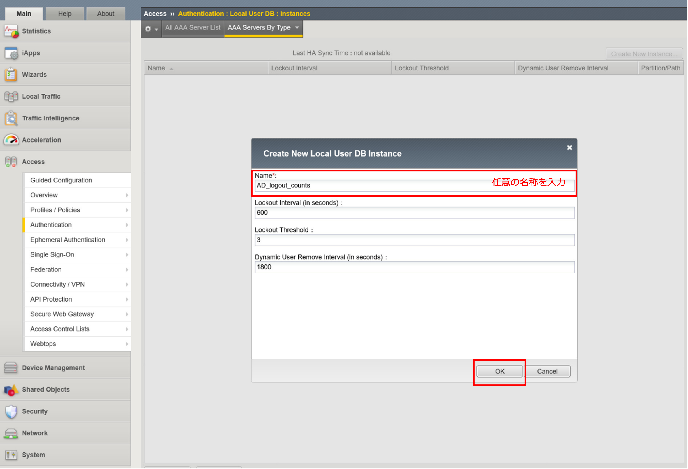

- VPE設定に戻ります。ここまでの設定では以下の状態になっています。「Logon Page」と「ADAuth」の2つをボックスの右上「×」をクリックして、削除します。

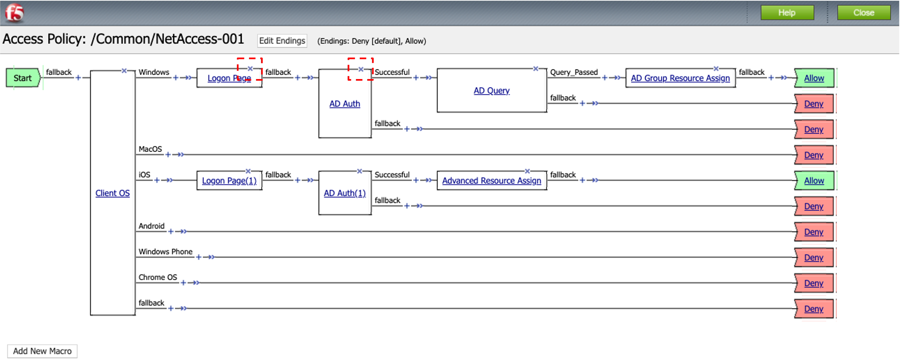

- 以下の状態になりますので、「Add New Macro」ボタンを押します。

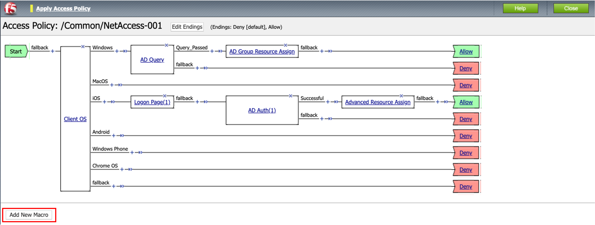

- 「Select macro template:」から「AD auth and LocalDB lockout」を選択し、Saveボタンを押します。

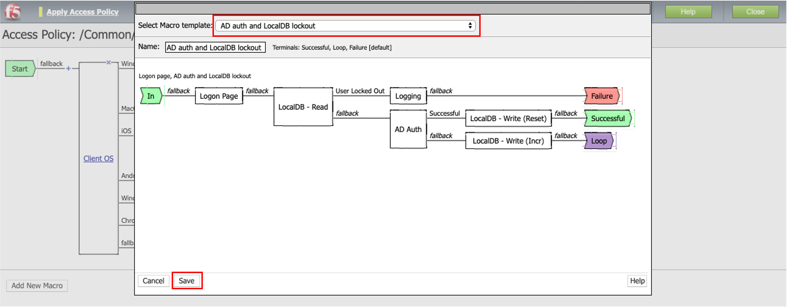

- 以下の「＋」をクリックすると、マクロが展開されます。

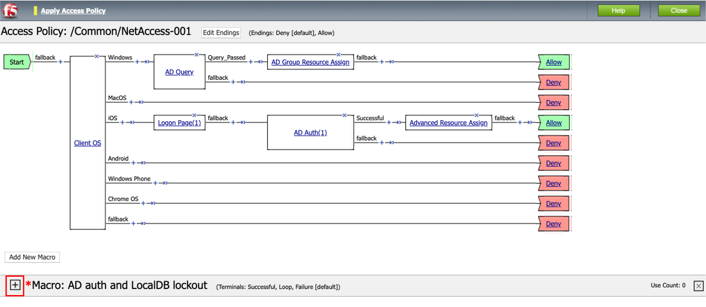

- 「*」部分は設定が不十分であることを表しています。以降、「*」の部分を設定していきます。

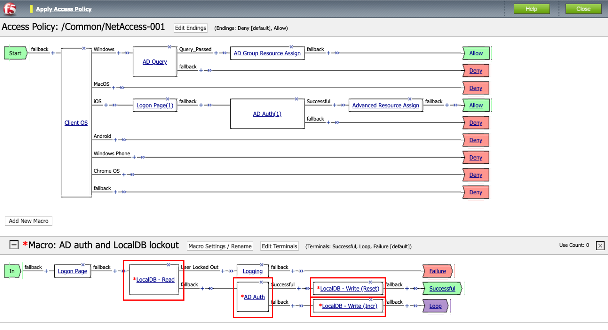

- 「LocalDB - Read」をクリックすると、以下の画面が現れます。設定したDBインスタンス (この例では"AD_lockout_counts")を選択し、「Save」ボタンを押します。

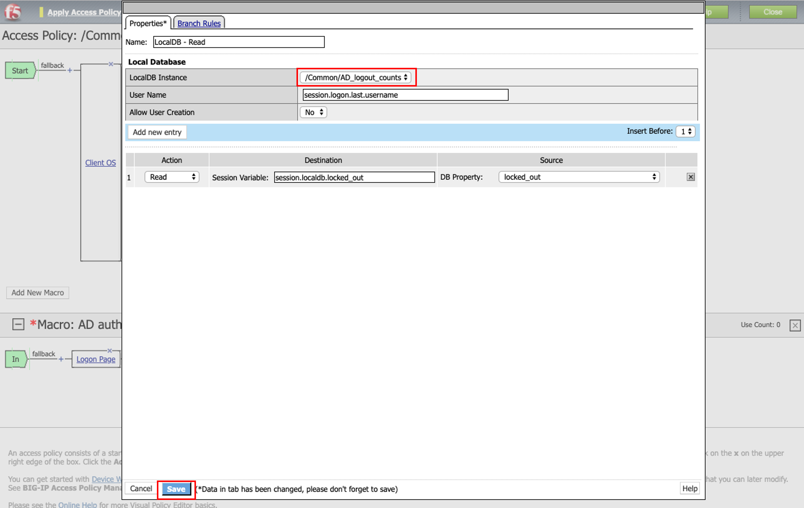

- 「AD Auth」をクリックすると、以下の画面が現れます。設定済みのActive DirectoryServer設定を選択し、「Save」ボタンを押します。

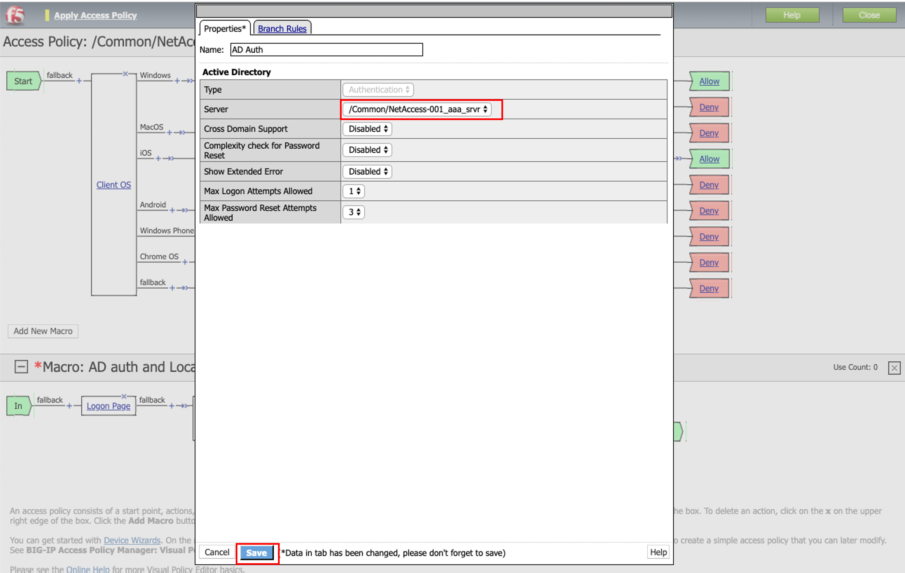

- 「LocalDB - Write (Reset)」をクリックすると、以下の画面が現れます。設定したDBインスタンス (この例では"AD_lockout_counts")を選択し、「Save」ボタンを押します。

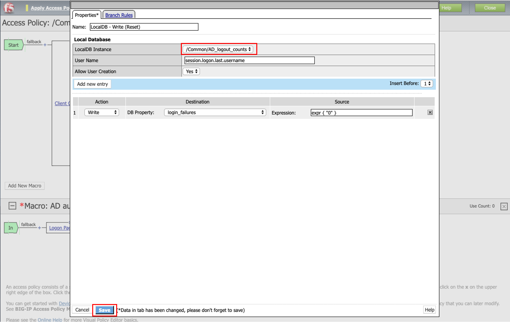

- 「LocalDB - Write (Incr)」をクリックすると、以下の画面が現れます。設定したDBインスタンス (この例では"AD_lockout_counts")を選択し、「Save」ボタンを押します。

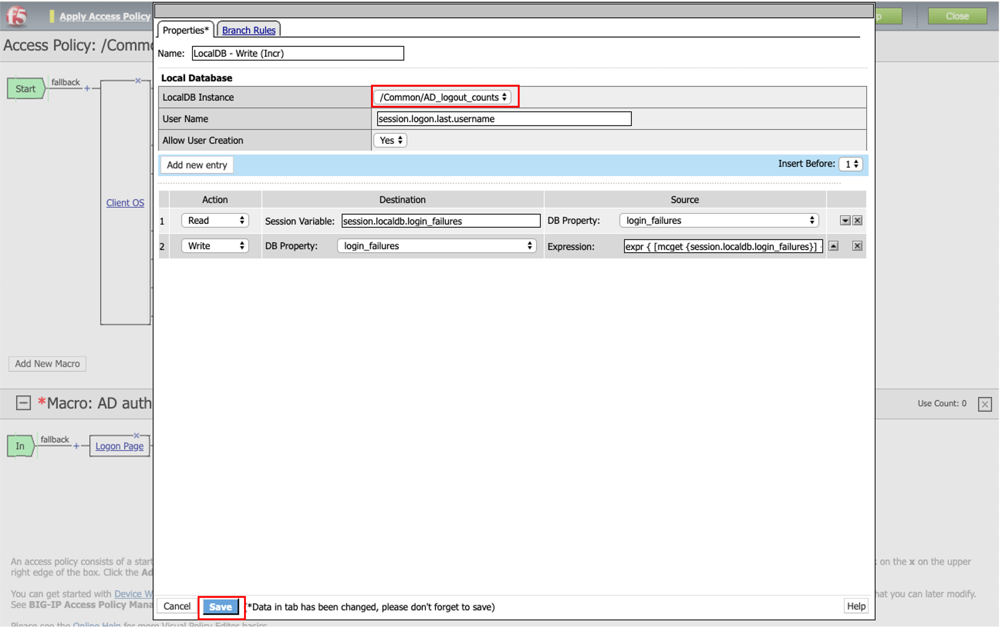

- 本サンプルでは、「AD Query」の前にマクロを入れることにします。「AD Query」の前の「+」をクリックします。

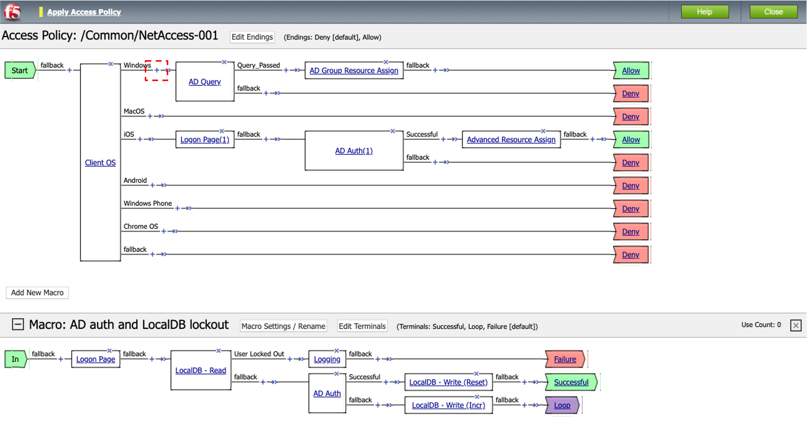

- 「Macros」タブで、設定した「Ad auth and LocalDB lockout」を選択し、「Add Item」ボタンを押します。

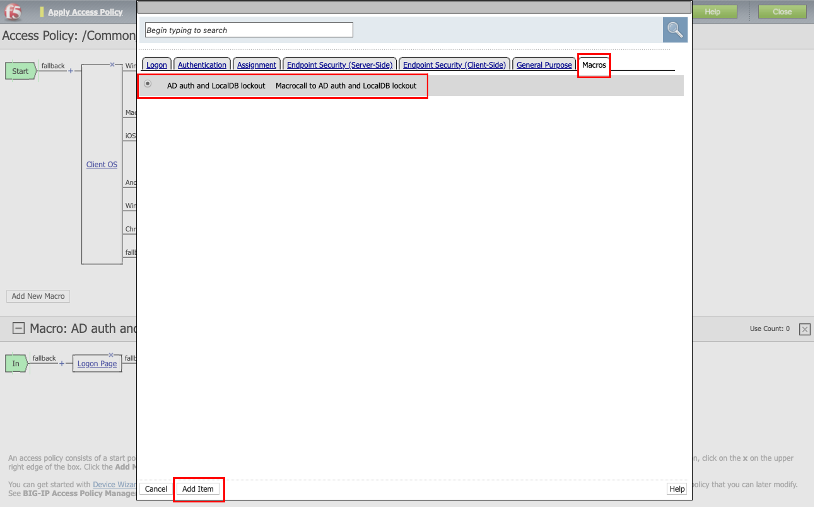

- 以下の状態になりますので、「Apply Access Policy」をクリックして設定を適用します。

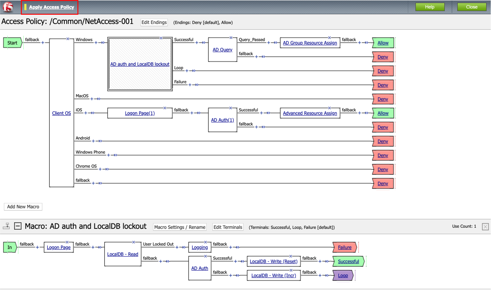

クライアントからのアクセス
^^^^^^^^^^^^^^^^^^^^^^^^^

- まずは、クライアントPCから正しいIDとパスワード (F5 UDF Labの場合は**test1001/ilovef5!**)でアクセスします。「Access」 → 「Authentication」 → 「Local User DB」 → 「Users」を確認します。すると、ユーザ: test1001がエントリされていることが分かります。

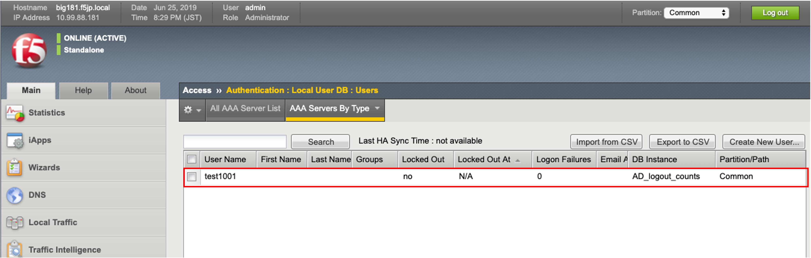

- 次に、「誤ったパスワード」で3回程度アクセスしてみます。以下のように、アクセスが拒否されたメッセージが表示されます。

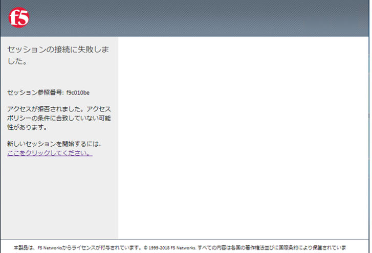

- 「Access」 → 「Authentication」 → 「Local User DB」 → 「Users」を確認すると、ユーザ: test1001がロックアウトされていることが分かります。対象ユーザを選択して「Unlock User」をクリックすると解除が可能です。

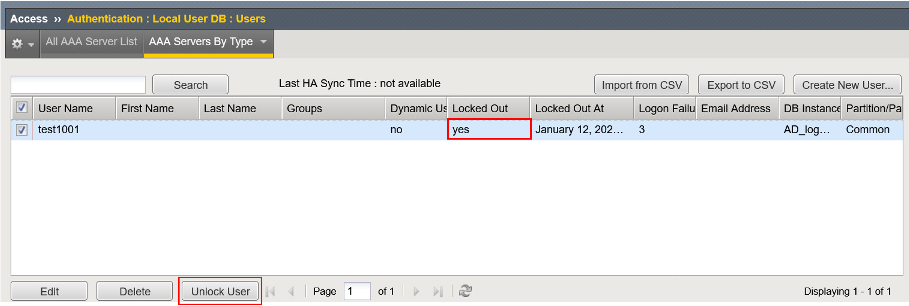

同じ設定をまとめる
--------------------------------------

要件として、「iOSとAndroidは同じ設定を行う」と仮定します。iOSとAndroidそれぞれに同じ設定を追加しても問題はないですが、見た目上、少し煩雑になります。そこで、ここではサンプルとして、「共通のマクロを生成して再利用する」という設定を行います。

- ここで一旦、iOSの分岐上にあるボックス全てを削除します。その後、「Add New Macro」ボタンをクリックします。

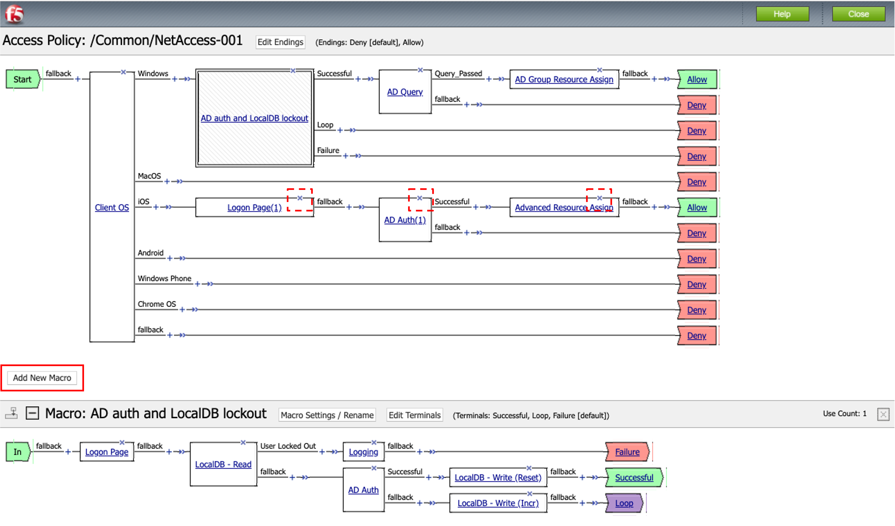

- ここではサンプルとして「AD auth and resources」を選択して、「Save」ボタンを押します。

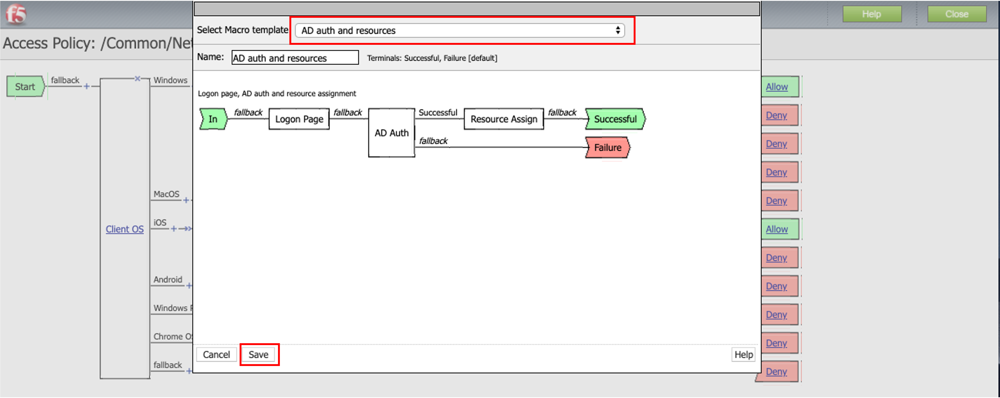

- 追加したマクロ: 「AD Aurh and resources」の「*」マークの付いたボックス: 「AD Auth」と「Resource Assign」をそれぞれ設定します (ここでは、設定内容は任意のもので結構です。)。
- その後、iOSとAndroidの分岐の「+」をクリックしてそのマクロを追加します。
- AndroidはEndingが「Deny」になっている場合は「Allow」に変更し、最後に「Apply Access Policy」をクリックして設定を適用します。

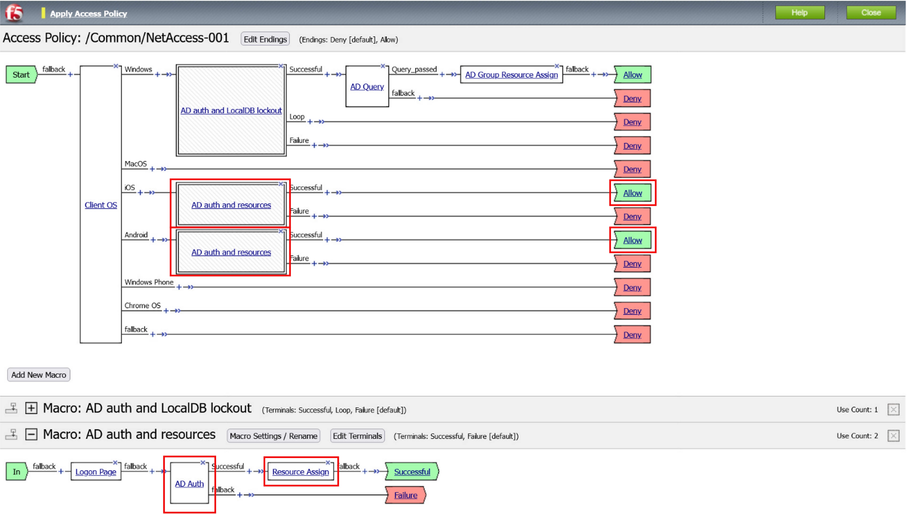

その他にも、APMでワンタイムパスワードを作成しメールで送信する設定や、AntivirusやFirewallのチェック機能の設定など、すぐに利用できる便利なマクロがありますので、確認してみてください。