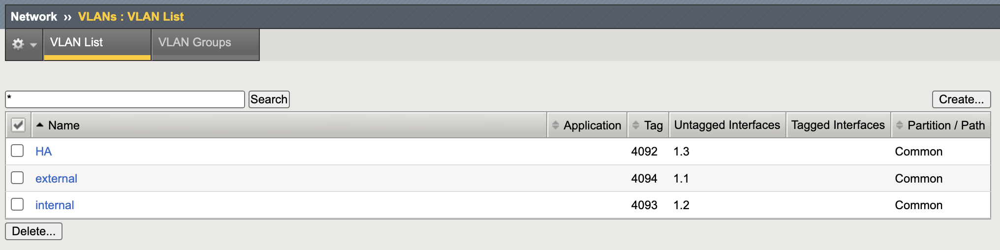
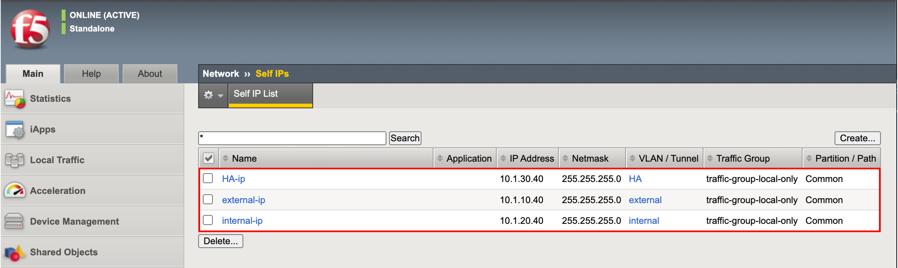
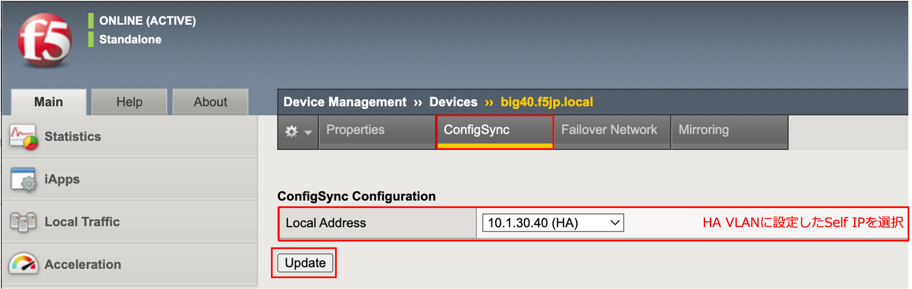
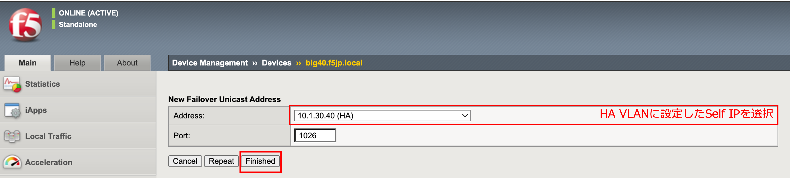
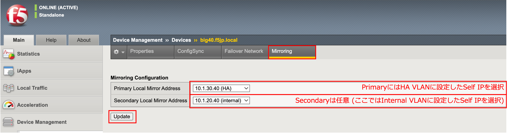
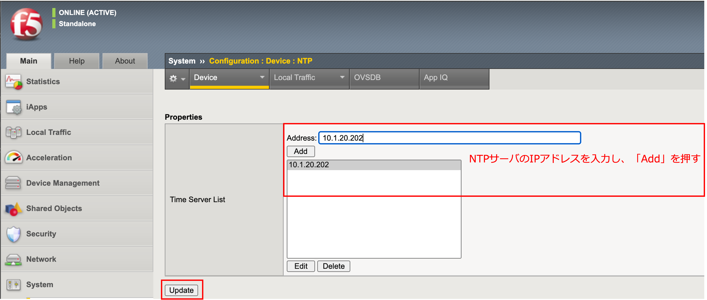

Standby機 (big40.f5jp.local)の設定
======================================

:doc:`../../content03/content03` および :doc:`../../content04/content04` を参照して、Standby機もActive機と同様の初期設定、ネットワーク設定を行います。

VLAN設定
--------------------------------------

- Standby機 (big40.f5jp.local)に設定されたVLANは以下のようになります。(Active機と同様です。)

Self-IP設定
--------------------------------------

- Standby機 (big40.f5jp.local)に設定されたSelf IPアドレスは以下のようになります。Port Lockdownの設定はActive機と同様に、external-ipは"Allow None"、internal-ipおよびHA-ipは"Allow Default"とします。

Device設定
--------------------------------------

「Device Management」→「Devices」で、自分自身: big40.f5jp.local (self)を選択し、Active機同様に、Device Connectivityの設定を行います。

- ConfigSync設定

- Failover Network設定

- Mirroring設定

NTP設定
--------------------------------------

NTPの設定もActive機同様に行います。

