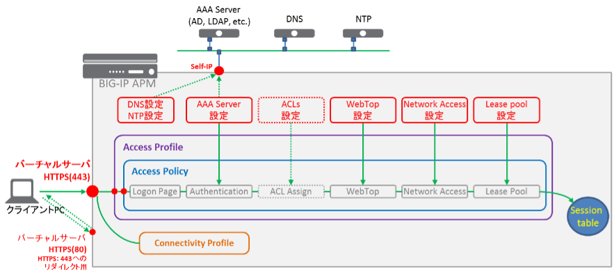

設定が必要なAPMオブジェクト
======================================

APMのバーチャルサーバにアクセスしてから、ネットワークアクセス (SSL-VPNトンネル)を確立するまでには、下図に示すような、様々なオブジェクトを経由します。

このことで、BIG-IP APMに設定したポリシーが適用された、ネットワークアクセスセッションが生成されます。

設定が必要な各オブジェクトの概要を以下に記載します。

- DNS/NTP設定: BIG-IP自身が問合せを行うサーバ設定です。
- AAA Server設定: Active Directory認証に必要な設定を行います。
- ACL設定: パケットフィルタリング設定です。このセクションでは設定しません。「VPEサンプル」の項をご確認下さい。
- WebTop設定: BIG-IP APMへのアクセス後に稼働するWebアプリケーションです。
- Network Access設定: SSL-VPNトンネルを行うための設定です。
- Lease Pool設定: クライアントPPPアダプタに割当てられるアドレス群です。
- Access Policy: 上記のオブジェクトをフローチャート形式で紐づける設定です。
- Access Profile: Access Policyの親的位置づけです。利用する言語をここで設定します。
- Connectivity Profile: コネクション上の圧縮設定やクライアント用ソフトウェアの設定を行います。

以降、上記の各オブジェクトを設定していきます。尚、既述の第4項の「ネットワーク設定」は完了しているものとして進めます。
