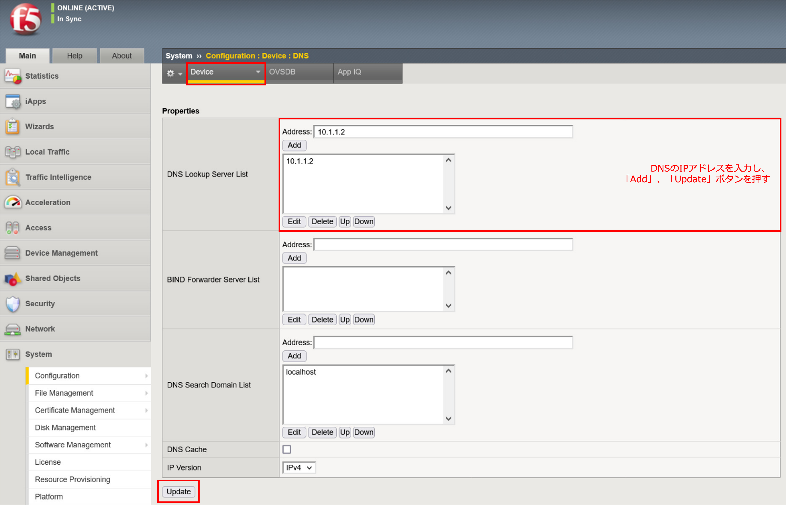
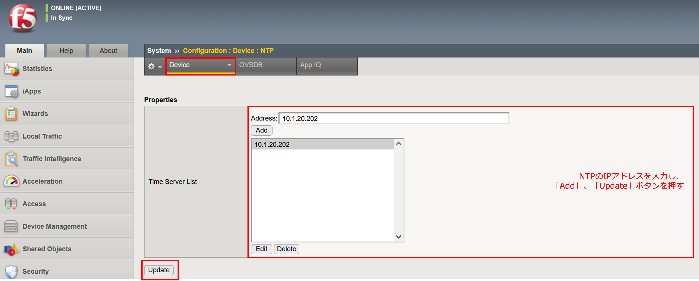
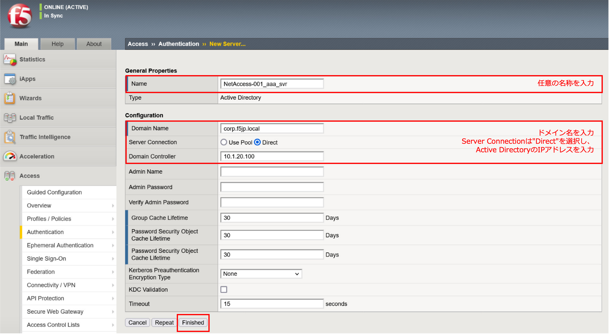
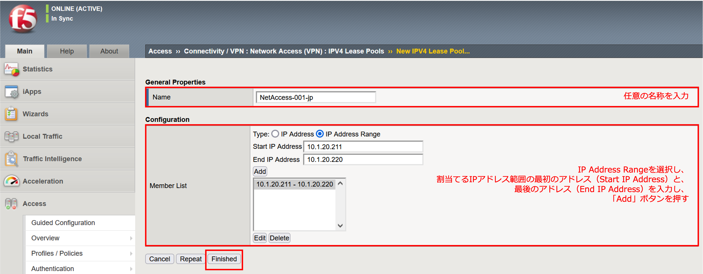
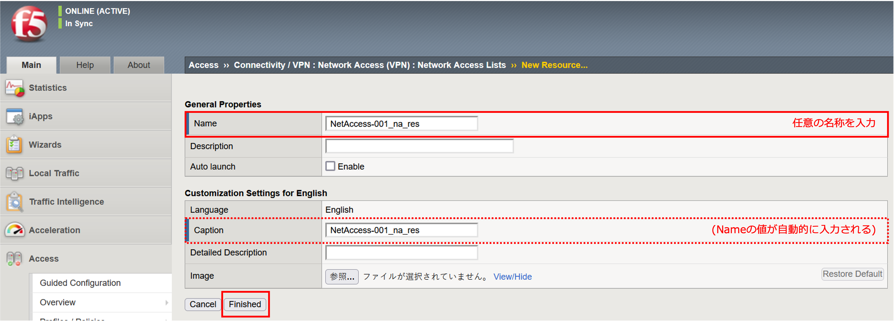
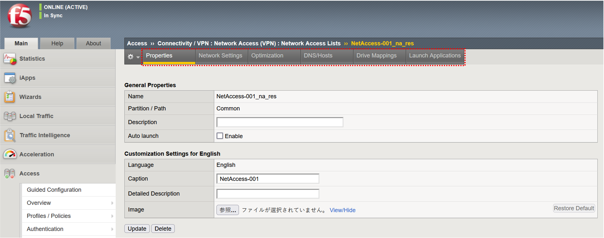
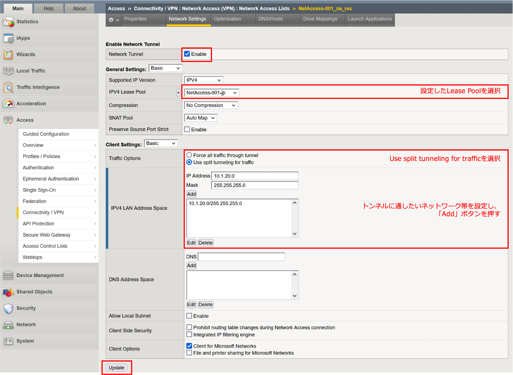
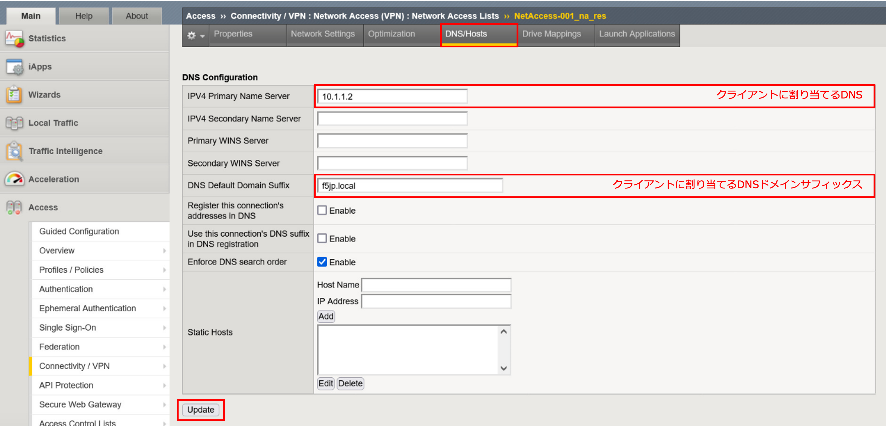
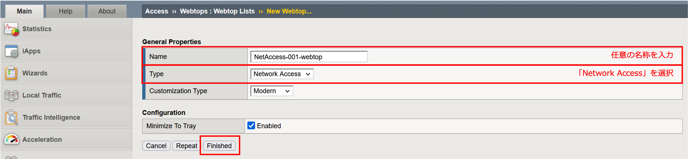
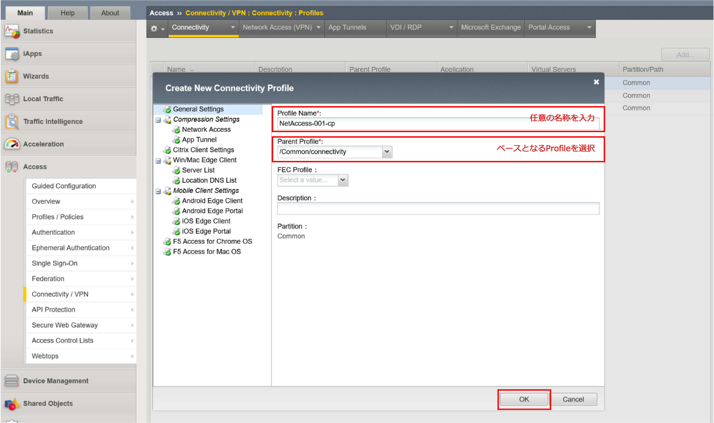

各オブジェクトの設定
======================================

DNS/NTP設定
----------------------------------------

- DNSを設定します。「System」 → 「Configuration」 → 「Device」タブから「DNS」を選択します。

- NTPを設定します。「Device」タブから「NTP」を選択します。

認証サーバ (Active Directory)の設定
----------------------------------------

「Access」 → 「Authentication」 → 「Active Directory」にて、「Create」ボタンを押します。

Lease Poolの設定
----------------------------------------

クライアントに割当てるIPアドレス群：リースプールを設定します。「Access」 → 「Connectivity / VPN」 → 「Network Access (VPN)」 → 「IPV4 Lease Pools」にて、「Create」ボタンを押します。

Network Accessの設定
----------------------------------------

- 「Access」 → 「Connectivity / VPN」 → 「Network Access (VPN)」 へ移動します。「Network Access List」タブを選択し、右に表示された「Create」ボタンを押すと以下の画面が出ます。以下のように値を入力し、「Finished」ボタンを押します。

- その後、以下のような画面 (タブメニューが追加された画面)に遷移します。

- 次にNetwork Settingsタブを選択し、既に設定したLease Poolを選択します。スプリット・トンネルの設定もここで行います。

- クライアントに割り当てるDNSやhostsを設定します。

Webtopの設定
----------------------------------------

「Access」 → 「Webtops」を選択します。右上に表示された「Create」ボタンを押すと、以下の画面が現れます。以下の2ヶ所を設定し、「Finished」ボタンを押します。

Connectivity Profileの設定
----------------------------------------

「Access」 → 「Connectivity / VPN」 → 「Connectivity」で以下の画面が現れます。右上に表示される「Add」ボタンを押すと、以下の画面が現れます。以下2ヶ所を設定し、「OK」ボタンを押します。

