Access ProfileとAccess Policyの設定
======================================

- 「Access」 → 「Profiles / Policies」 → 「Access Profiles (Per-Session Policies」を選択し、右上に表示された「Create」ボタンを押して以下のように設定します。

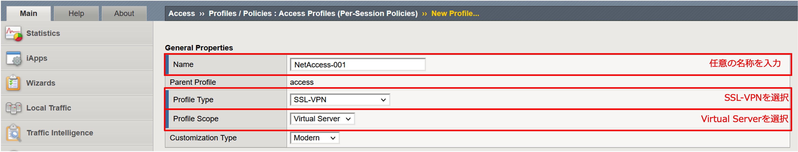

- 同ページの下方にて、利用したい言語を選択し、「Finished」ボタンを押します。

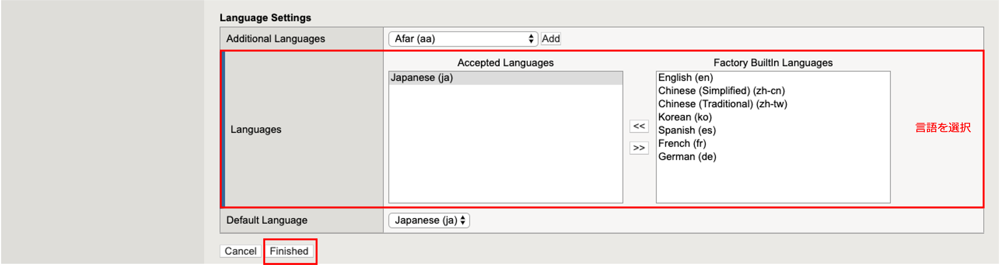

- その後、以下の画面に遷移します。ここで、Access Policyを設定するために、「Edit…」をクリックします。

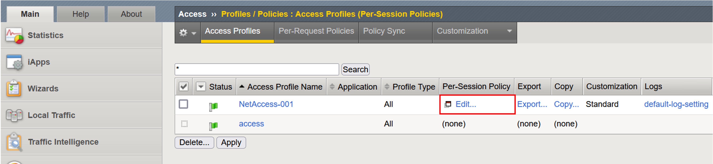

- 以下の画面: Visual Policy Editor (VPE)が表示されます。"Start"と"Deny"の線上にある、「+」をクリックします。

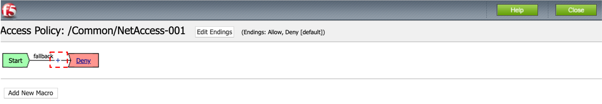

- その後、以下の画面が現れます。「Logon」タブで、「Logon Page」を選択し、「Add Item」ボタンを押します。

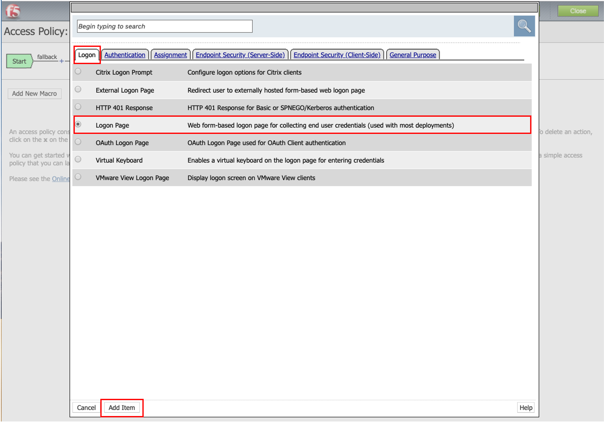

- その後、以下の画面が現れます。ここでは特に変更は行わず、「Save」ボタンを押します。

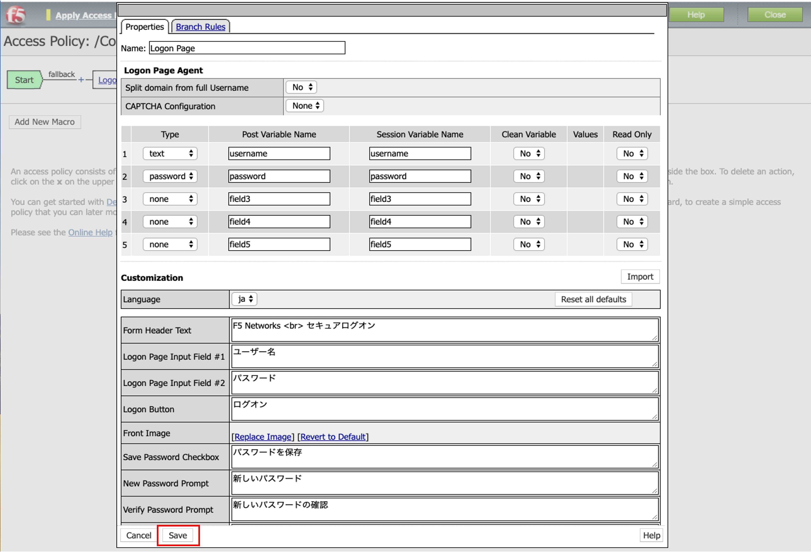

- 以下のような状態になりますので、Logon Pageの後ろにある「+」をクリックします。

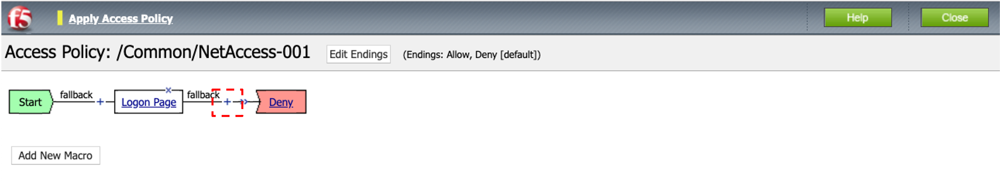

- 以下の画面が現れます。「Authentication」タブで、「AD Auth」を選択し、「Add Item」ボタンを押します。

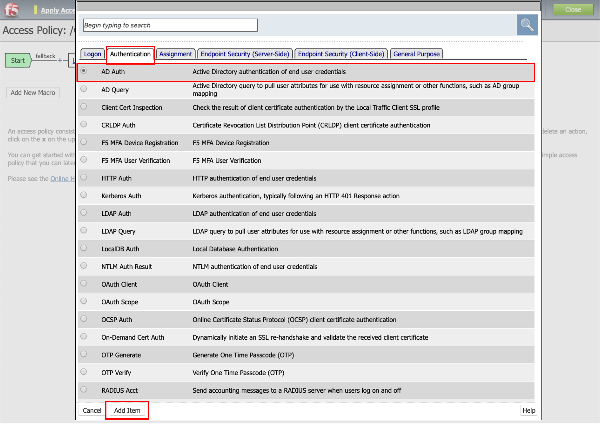

- 以下の画面が現れます。「Server」の項目で、既に設定したAAAサーバ: Active Directoryを選択し、「Save」ボタンを押します。

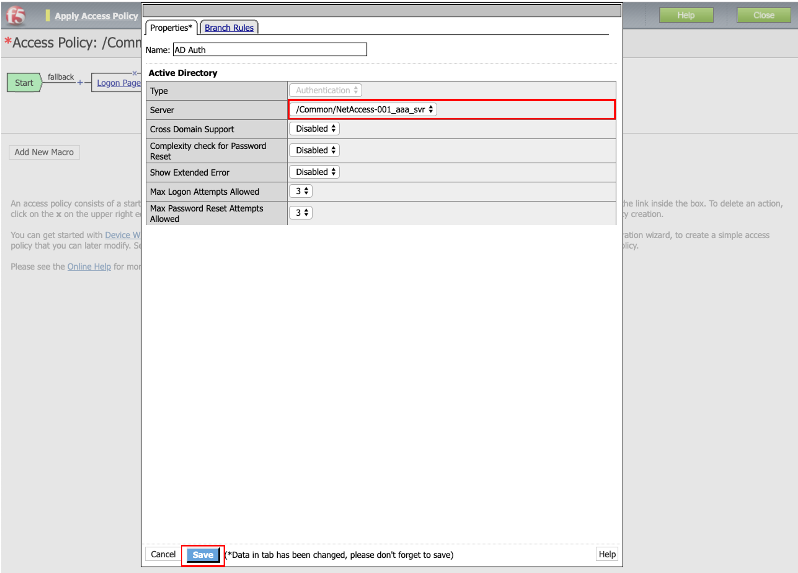

- 以下のような状態になります。「AD Auth」の後ろにある、Successful側の「+」をクリックします。

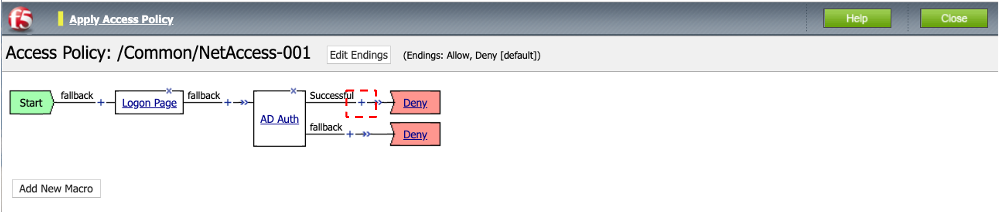

- 以下の画面が現れます。「Assignment」タブで、「Advanced Resource Assign」を選択し、「Add Item」ボタンを押します。

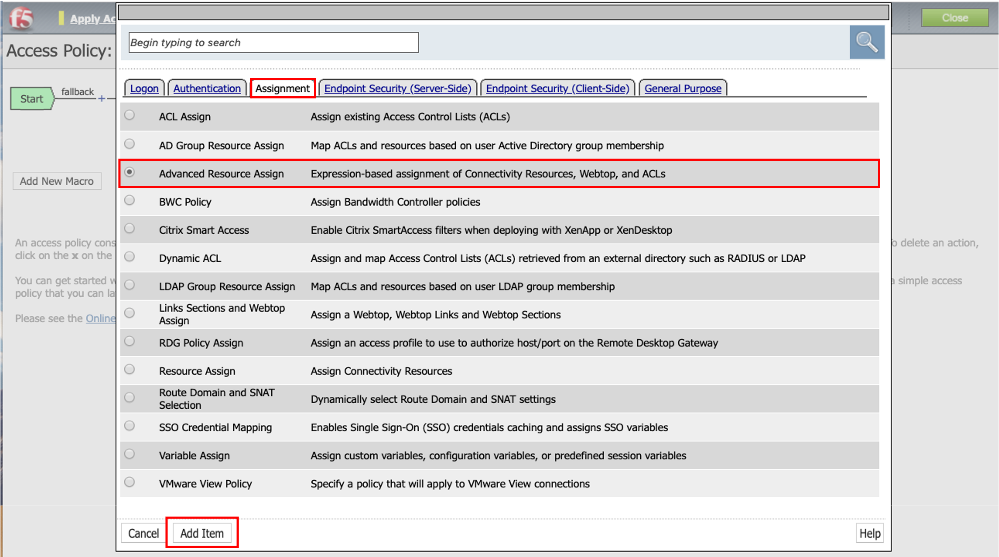

- 以下の画面が現れます。「Add new entry」ボタンを押して、Expressionを1つ追加します。その下の「Add/Delete」をクリックします。

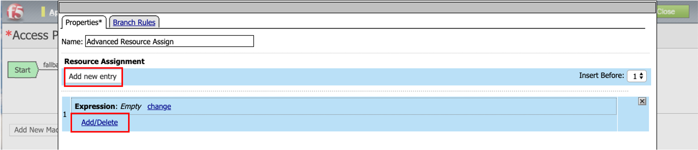

- 以下の画面が現れます。「Network Access」タブで、既に設定したNetwork Accessリソースのチェックボタンにチェックを入れます。

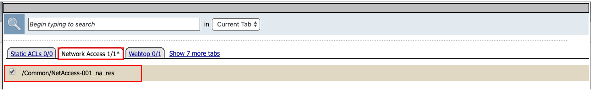

- 「Webtop」タブで、既に設定したNetowrk Access用Webtopのチェックボタンにチェックを入れます。「Update」ボタンを押します。

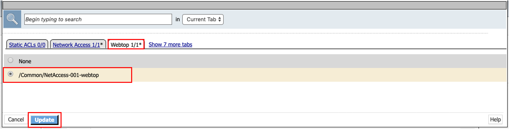

- 以下のような状態になります。「Save」ボタンを押します。

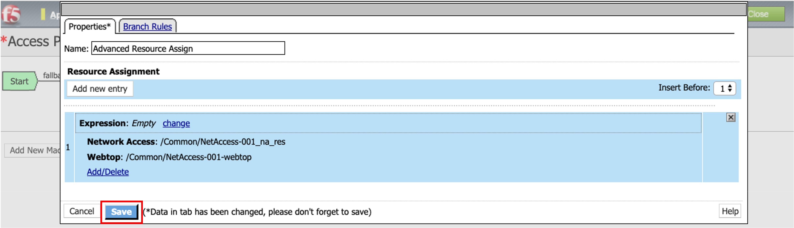

- 以下のような状態になります。最後に「Advance Resource Assign」の後ろにある「Deny」を「Allow」に変更する必要があるので、「Deny」をクリックします。

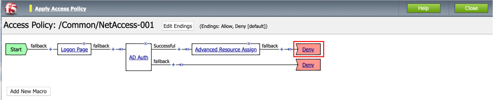

- 以下のような画面が現れます。「Allow」を選択し、「Save」ボタンを押します。

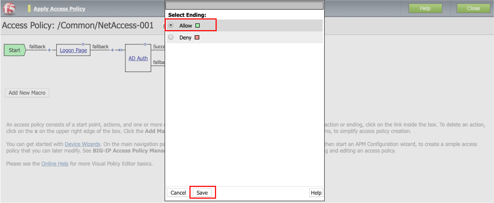

- VPEの設定は以上ですが、まだ設定した値は適用されていません。左上に表示されている「Apply Access Policy」をクリックすることで、設定が適用されます。

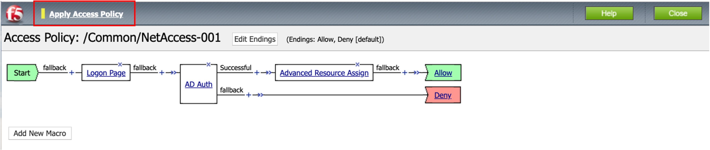

