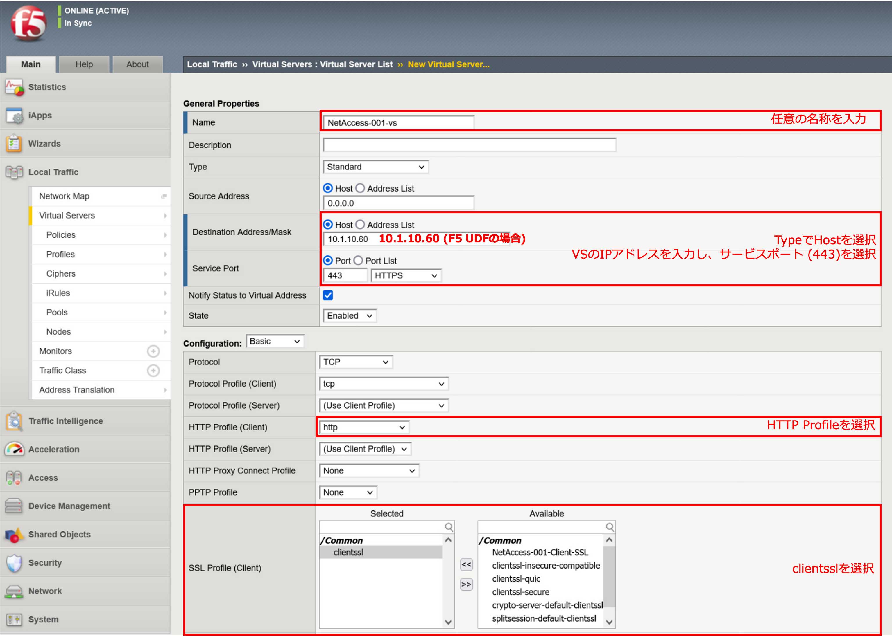
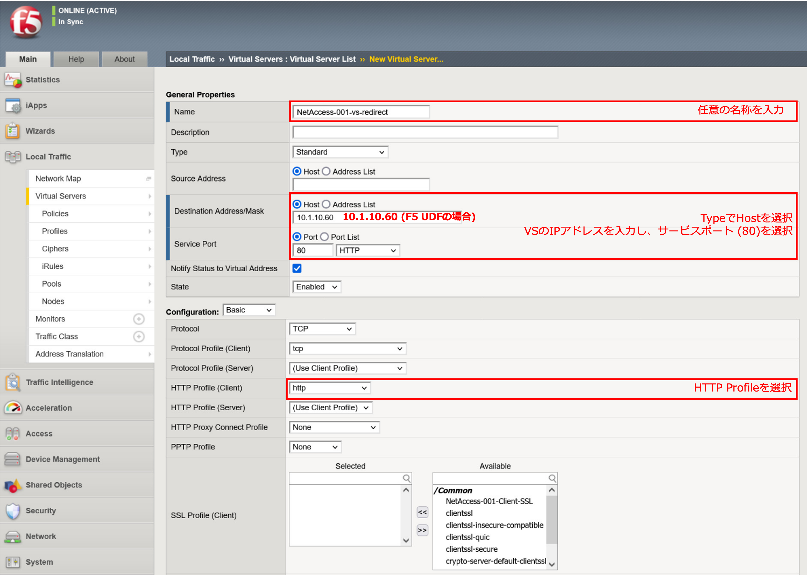
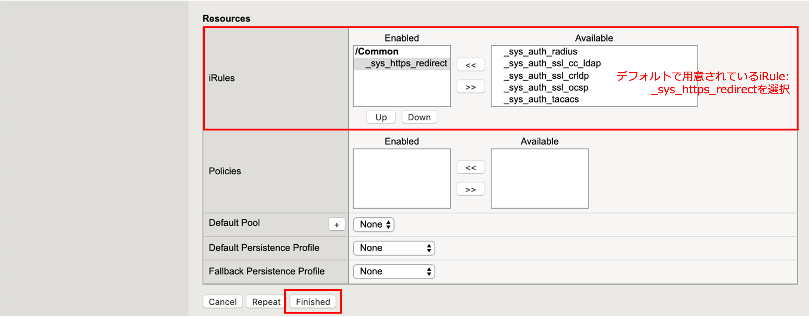

Virtual Serverの設定と確認
======================================

APM用Virtual Serverの設定
----------------------------------

「Local Traffic」 → 「Virtual Servers」 を選択します。右上の「Create」ボタンを押すと以下の画面が現れます。以下のように設定します。

(中略)

(中略)

リダイレクト用Virtual Serverの設定
----------------------------------

HTTP (80)でアクセスしても、APM用Virtual Server (HTTPS (443))へリダイレクトされるように、リダイレクト用のVirtual Serverを新規に設定します。

(中略)

以上で、ウィザードで設定した内容と同等の状態になります。

クライアントPCからのアクセス
----------------------------------

:doc:`../../content05/module02/module02` を参照して、設定したVirtual Serverへのアクセスが完了することを確認します。
